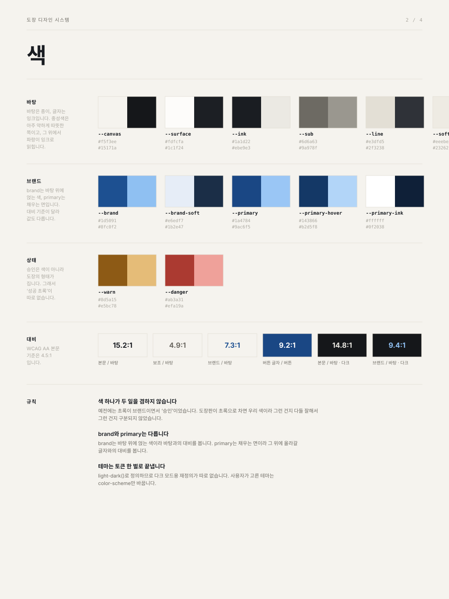
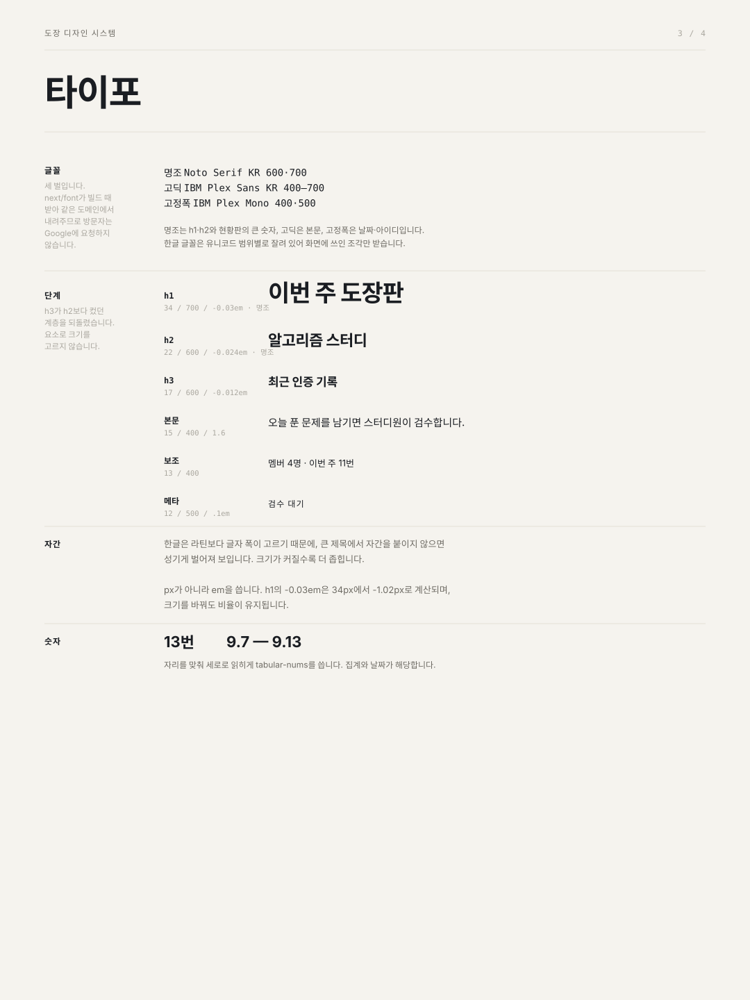
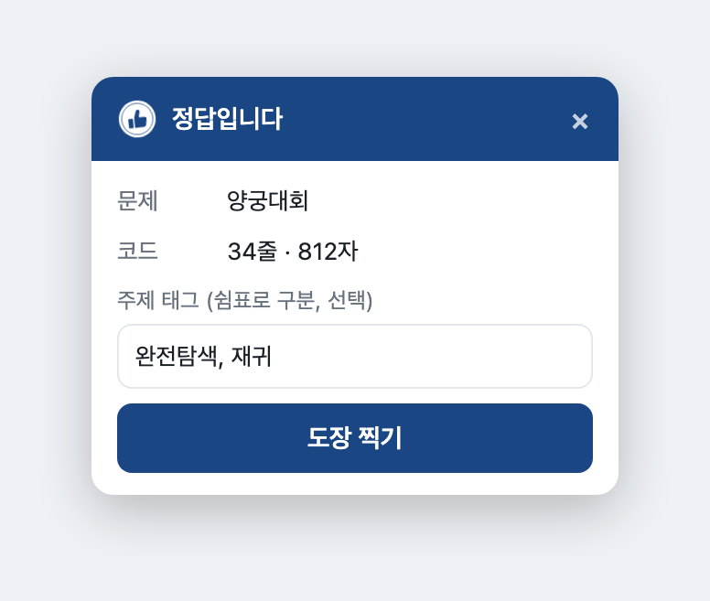

# 도장

초대된 멤버끼리 매일의 인증 기록을 제출하고 확인하는 스터디 서비스입니다. 코딩 테스트, 기상, 운동처럼 무엇을 인증할지는 그룹이 정합니다. 기록과 사진은 멤버만 보고, 공개로 연 스터디의 순위는 로그인 없이 볼 수 있습니다.

진행 중인 Vercel 배포 상태는 [`docs/DEPLOYMENT_HANDOFF.md`](docs/DEPLOYMENT_HANDOFF.md)에서 확인합니다.

## 현재 범위

- GitHub OAuth 로그인을 위한 Supabase SSR 클라이언트
- 초대·멤버십·플랫폼 계정·풀이 인증·검수 데이터 모델
- `ACTIVE` 그룹 멤버 기준 PostgreSQL RLS
- 증빙 이미지·영상용 비공개 Storage 정책
- 그룹 생성, 5자리 초대코드 공유·가입 신청, 소유자 가입 승인
- 플랫폼 계정 없이 사진으로 인증 등록, 승인·반려 검수 화면, 그룹별 자동 인정 설정
- 그룹별 사진 필수·코딩 테스트 스터디 설정과 그에 따라 달라지는 입력·문구
- 로그인 없이 보는 스터디 목록과 공개 그룹의 리더보드
- 풀이에 남긴 문제 링크와 그룹이 푼 문제 모음, 소유자·검수자의 문제 제목 수정
- 그룹 현황판: 오늘 참여 인원, 멤버별 주간·누적 승인과 검수 대기, 주간 인증 매트릭스와 지난 주 이동
- 풀이 기록 탭·필터와 사진·검수를 한 화면에서 처리하는 상세 모달
- 소유자의 검수자 지정·해제, 초대 링크를 유지하는 로그인 재시도·계정 전환
- 본인 닉네임·한 줄 소개를 정하는 프로필 화면과 신원 확인용 GitHub 아이디 표시
- Vercel 배포가 가능한 Next.js 기본 화면

그룹 생성과 초대 수락은 인증 사용자를 확인하는 PostgreSQL 함수에서 원자적으로 처리합니다. 그룹 데이터는 서버와 RLS에서 모두 `ACTIVE` 멤버십을 확인합니다.

사진을 올리면 인증 기록이 생성됩니다. 자동 인정을 켠 그룹은 바로 인정되고, 꺼져 있으면 검수 대기로 들어갑니다. 등록 창 아래 안내도 이 설정을 따라갑니다. 플랫폼 계정은 필요하지 않고 제목과 문제 링크는 선택입니다. JPG·PNG·WebP 원본을 20MB까지 선택할 수 있습니다. 브라우저에서 긴 변 최대 1,440px, 120KB 목표로 WebP 압축하며 필요하면 1,200px·1,024px까지 줄입니다. 대부분 화면 캡처라 이 정도로 줄여도 문제명·아이디·통과 결과가 읽힙니다. 작은 원본은 확대하지 않고, WebP 미지원 브라우저는 JPEG를 사용합니다. 파일 선택 대신 캡처를 복사해 등록 창에 붙여넣어도 됩니다. 압축이 끝나면 바로 등록할 수 있고, 압축본 미리보기와 ‘크게 열어 글자 확인’으로 글자를 확인할 수 있습니다. 저장 한도는 300KB이며, 초과하면 필요한 부분만 잘라 다시 선택해야 합니다. 새 업로드는 Storage 버킷에서도 같은 한도를 적용합니다. 기존 사진은 변경하지 않습니다.

사진의 문제명·풀이 날짜를 자동 추출하지 않으며 등록 시각을 기록합니다. 사진 확인은 그룹의 `OWNER`와 `REVIEWER`가 합니다.

## 디자인 시스템

| | |
|---|---|
| [](docs/design/01-seal.svg) | [](docs/design/02-colour.svg) |
| [](docs/design/03-type.svg) | [](docs/design/04-parts.svg) |

바탕은 종이, 글자는 잉크입니다. 도장은 종이에 찍는 것이라 화면을 장부처럼 다룹니다. 아주 약하게 따뜻한 종이색 위에 브랜드 파랑을 잉크로 쓰고, 제목과 큰 숫자는 명조(Noto Serif KR), 본문은 IBM Plex Sans KR, 날짜·아이디는 IBM Plex Mono입니다.

브랜드는 파랑입니다. 예전에는 초록 하나가 브랜드 정체성이면서 동시에 ‘승인·성공’이라는 의미색이었습니다. 도장판이 초록으로 차오를 때 그게 우리 색이라서인지 다들 잘해서인지 구분되지 않았습니다. 브랜드를 파랑으로 옮기면서 두 축을 갈랐고, 승인은 색이 아니라 도장이 찍혔다는 사실이 지게 했습니다. 별도의 ‘성공 초록’이 사라져 색이 하나 줄었습니다.

값과 규칙은 [`docs/DESIGN_SYSTEM.md`](docs/DESIGN_SYSTEM.md)에 있습니다. 색 토큰, 도장,
상태 표현, 타이포, 모서리, 확장 프로그램의 제약을 다룹니다.

## 크롬 확장 프로그램

`extension/`에 있습니다. 앱을 열고 그룹을 찾아 모달을 띄우는 과정을 줄입니다.

- **아이콘 클릭**: 보고 있는 탭 화면을 캡처해 등록합니다. 페이지 내용을 읽지 않고 `activeTab`만 쓰므로 코딩 사이트 권한이 필요 없습니다.
- **프로그래머스에서 정답이 되면**: 오른쪽 위에 카드가 떠, 주제 태그를 적고 누르면 제출한 코드가 그대로 기록됩니다. 채점 결과 모달의 제목과 사용자가 제출한 코드만 읽고 문제 설명은 읽지 않습니다.



신원은 웹과 같은 GitHub OAuth를 `chrome.identity`로 태워 확보합니다. 별도 키 체계나 테이블이 없고 서버는 지금처럼 토큰을 확인합니다. 등록은 `POST /api/proofs`로 받으며, 화면이 쓰는 서버 액션과 같은 규칙(`src/lib/proof-record.ts`)을 공유합니다.

[릴리스 페이지](https://github.com/HongYeseul/coding-test-verification/releases/latest)에서 zip을 받아 압축을 풀고, 크롬의 ‘압축해제된 확장 프로그램을 로드합니다’로 그 폴더를 고르면 끝입니다. 기본값이 운영 환경이라 주소나 키를 입력할 필요가 없습니다.

`manifest.json`의 `key`로 확장 아이디를 `pkpabpnpecgcpakaehojnphgeajoieih`에 고정했습니다. 누가 설치하든 같은 아이디라 로그인 복귀 주소 `https://pkpabpnpecgcpakaehojnphgeajoieih.chromiumapp.org/*`를 Supabase에 한 번만 등록하면 됩니다.

로컬 개발용 사본은 `bash extension/install.sh`가 만들어 줍니다. 자세한 절차와 깨질 수 있는 부분은 [`extension/README.md`](extension/README.md)에 있습니다.

## 구성

- Next.js App Router, TypeScript, Tailwind CSS
- Supabase Auth, PostgreSQL, Storage
- Vercel
- Node.js 24, pnpm 11

별도 서버를 운영하지 않습니다. GitHub의 `main` 브랜치를 Vercel Production에 연결하고, 다른 브랜치와 Pull Request는 Preview 배포로 확인합니다.

## 로컬 실행

```bash
nvm install
nvm use
corepack enable
pnpm install
cp .env.example .env.local
pnpm dev
```

`http://localhost:3000`에서 확인합니다. Supabase 환경변수가 비어 있으면 화면은 열리지만 GitHub 로그인 버튼은 비활성화됩니다.

## 환경변수

```env
NEXT_PUBLIC_SUPABASE_URL=
NEXT_PUBLIC_SUPABASE_PUBLISHABLE_KEY=
NEXT_PUBLIC_SITE_URL=http://localhost:3000
```

프로젝트 URL과 Publishable Key는 Supabase의 Connect 화면에서 확인합니다. 관리자 키는 현재 필요하지 않으며 브라우저 환경변수로 추가하면 안 됩니다.

## 명령어

```bash
pnpm dev
pnpm lint
pnpm typecheck
pnpm build
pnpm check
pnpm test
```

## 용어

같은 것을 여러 말로 부르면 화면마다 다른 제품처럼 보입니다. 문구를 쓸 때 이 표를 따릅니다.

| 말 | 무엇 |
|---|---|
| **도장 찍기** | 기록을 남기는 행동. 버튼과 진행·완료 문구에 씁니다 |
| **인증** | 남은 기록. 일반 스터디에서 부르는 이름 |
| **풀이** | 남은 기록. 코딩 테스트 스터디에서 부르는 이름 |
| **도장판** | 멤버를 행, 요일을 열로 놓은 주간 현황표 |
| **검수** | 다른 멤버가 기록을 확인하는 일 |
| **승인 · 반려** | 검수 결과 |
| **자동 인정** | 검수 없이 바로 승인되게 하는 그룹 설정. 그렇게 통과한 기록은 ‘자동 인정’으로 표시합니다 |
| **응원** | 멤버가 남의 기록에 남기는 하트 하나. 검수가 아니고 집계에도 들어가지 않습니다 |
| **등록** | 장부 표현에만 씁니다 — 등록 시각, 최근 등록순, 플랫폼 계정 등록 |

가르는 기준은 **행동이냐 결과물이냐**입니다. 누르는 것은 언제나 도장 찍기 하나이고,
남는 것을 부를 때만 인증·풀이로 갈립니다. ‘인증하기’, ‘풀이 인증하기’,
‘인증 등록하기’처럼 둘을 붙여 부르지 않습니다.

행동에는 그룹 종류가 상관없습니다. 코딩 테스트든 기상이든 누르는 버튼은 같습니다.

## 인증 종류

무엇을 인증하는 스터디인지는 유형 목록이 아니라 그룹 설정 두 개가 정합니다.

- **사진 필수**: 기본은 켬입니다. 끄면 사진 없이 한 줄 메모만으로 인증을 남길 수 있습니다.
- **코딩 테스트 스터디**: 켜면 문제 링크 입력과 ‘우리 그룹이 푼 문제’ 목록을 씁니다. 끄면 오른쪽 문제 목록 칸이 사라져 한 칸으로 놓입니다. 버튼은 어느 쪽이든 ‘도장 찍기’이고, 남은 기록을 부르는 말과 입력 라벨만 갈립니다 — 기록 목록 제목이 ‘풀이 기록’·‘인증 기록’, 입력 라벨이 ‘문제 제목’·‘한 줄 메모’로.

둘은 서로 독립이라 네 가지 조합이 모두 유효합니다. 기상 스터디는 사진 필수를 켠 채 코딩 테스트를 끈 조합이고, 사진 없이 기록만 남기는 스터디는 둘 다 끈 조합입니다. 유형을 `CODING`·`WAKE_UP`처럼 값으로 나누지 않은 이유는, 값이 늘어도 달라지는 것이 한국어 문구뿐이라 마이그레이션 비용만 생기기 때문입니다. 문구가 갈리는 지점은 실제로 ‘코딩 테스트 스터디’ 하나뿐입니다.

그룹을 만들 때는 코딩 테스트 여부만 고르고, 사진 필수는 만든 뒤 설정에서 바꿉니다. 기존 그룹은 마이그레이션에서 모두 코딩 테스트 스터디로 옮겨 화면이 그대로 유지됩니다.

코딩 스터디에서는 사진 대신 풀이 코드를 남길 수 있습니다. 코드는 사진의 100분의 1 크기이면서 읽고 비교할 수 있어, 통과 화면 이미지보다 서로에게 남는 것이 많습니다. `proofs.solution_code`에 2만 자까지 보관하며, 코드가 있으면 ‘사진 필수’를 켠 그룹에서도 사진 없이 등록됩니다. 코드는 활성 멤버만 보고 공개 리더보드로는 나가지 않습니다. 코딩 스터디가 아닌 그룹은 코드를 받지 않습니다.

인증에는 주제 태그를 5개까지 달 수 있습니다. 해시·DP처럼 무엇을 연습했는지 적어두면 나중에 그룹이 무엇을 해왔는지 훑어볼 수 있습니다. 쉼표로 나눠 적고, 대소문자만 다른 태그는 하나로 봅니다. 개수나 길이를 넘기면 말없이 자르지 않고 오류로 알려줍니다 — 태그는 하나씩 뜻이 있어 조용히 사라지면 안 됩니다.

사진 필수를 끈 그룹의 기록에는 사진 경로가 없어 `proofs_evidence_path_unique`가 재시도 중복을 막아주지 못합니다. 대신 브라우저가 만든 열쇠를 `problem_key`에 넣고 `(group_id, user_id, problem_key)`에 부분 유일 인덱스를 걸어 같은 자리를 맡깁니다. 이 열쇠는 화면에 보여주지 않습니다.

설정을 바꿔도 이미 등록된 기록은 그대로입니다. 사진 필수 확인은 등록할 때만 하므로, 사진 없이 등록한 뒤 사진 필수를 다시 켜도 그 기록의 검수는 막히지 않습니다. 코딩 테스트를 꺼도 남긴 링크는 지워지지 않고 다시 켜면 목록에 돌아옵니다.

## 자동 인정

소유자는 스터디 이름 옆 설정 아이콘을 눌러 여는 모달에서 ‘자동 인정’을 켤 수 있습니다. 자주 여는 화면이 아니라 본문에 상시로 두지 않습니다. 아이콘은 조절기 모양이며, 상단바의 테마 아이콘과 겹치지 않도록 톱니바퀴 대신 골랐습니다. 켜면 새 기록이 등록하는 순간 인정으로 시작하고, 소유자·검수자가 반려할 때만 미인정으로 내려갑니다. 기본값은 꺼짐이라 지금까지처럼 검수 대기로 들어옵니다. 설정을 바꿔도 이미 등록된 기록의 상태는 그대로입니다.

자동 인정된 기록은 목록에 `자동 인정`으로 보이고 현황판의 승인 집계에 함께 들어갑니다. 검수 대기 집계에는 들어가지 않습니다. 즉시 인정이라 잘못 올린 사진을 본인이 지울 수 있도록, 자동 인정된 본인 기록은 취소할 수 있습니다. 반려된 기록은 지금처럼 본인도 취소할 수 없습니다.

반려는 계속 소유자와 검수자만 할 수 있고 이유를 적어야 합니다. 설정이 꺼진 그룹에서는 브라우저에서 직접 요청해도 인정 상태로 등록되지 않도록 `proofs_insert_self` 정책이 `private.group_auto_approves()`로 막습니다.

## 화면 구성

폭 1024px 안에 상단바와 그룹 헤더를 두고, 그 아래를 넓은 화면에서 두 칸으로 나눕니다. 헤더 바로 아래에는 ‘오늘 띠’가 있어 오늘 누가 도장을 찍었는지 이름 칩으로 보여줍니다. 찍은 사람이 앞에 오고, 남은 사람은 흐리게 두되 이름을 부르는 건 남은 사람이 나일 때뿐입니다. 서로 독려하는 서비스라 오늘의 상태가 표 안에 묻히지 않게 한 것입니다. 왼쪽에 주간 현황과 풀이 기록, 오른쪽에 ‘우리 그룹이 푼 문제’를 두며 오른쪽 칸은 스크롤을 따라옵니다. 1024px보다 좁으면 세로로 쌓입니다. 그림자 없이 1px 테두리와 라운드만 씁니다. 색과 모서리는 토큰 한 벌로 모아 `light-dark()`로 라이트·다크를 함께 처리합니다. 값은 [디자인 시스템](docs/DESIGN_SYSTEM.md)에 정리해 두었습니다. 본문은 15px이고 목록에서 가장 먼저 읽는 풀이 제목은 17px입니다. 보조 설명은 13px, 집계 같은 메타 정보는 12px을 씁니다. 간격은 모두 4px 배수를 씁니다.

상단바의 아이콘 버튼으로 시스템·라이트·다크를 고릅니다. 시스템은 반쪽 채운 원, 라이트는 해, 다크는 초승달이며 현재 상태를 아이콘으로 보여줍니다. 고른 값은 브라우저에 저장하고 다음 방문에도 유지하며, 시스템을 고르면 OS 설정을 따릅니다. 색·간격·버튼 정의는 `src/app/globals.css`에 모여 있습니다.

주간 현황은 멤버를 행, 월요일부터 일요일까지를 열로 놓은 표입니다. 멤버는 선택한 주의 승인 건수가 많은 순으로 놓고, 같으면 누적 승인이 많은 순, 그다음 닉네임순입니다. 멤버 열 머리글에 `· 이번 주 승인순`이라고 적고 마우스를 올리면 동점 규칙까지 설명합니다. 주를 옮기면 그 주의 승인 건수로 순서를 다시 계산합니다. 카드 위쪽에는 오늘 인증·선택한 주 승인·검수 대기를 큰 숫자로 나란히 둡니다. 세 값 모두 현황판 응답에 이미 있어 조회가 늘지 않습니다.

기록이 있는 칸은 승인이면 잉크 도장을 찍고, 검수 대기는 같은 엄지를 점선 윤곽으로만 그린 도장, 반려 `×`는 둥근 네모 테두리로 둡니다. 두 건 이상이면 칸 어깨에 건수를 답니다. 점선 도장은 ‘내가 찍었지만 동료가 확인해야 잉크가 채워진다’는 서비스의 약속을 형태로 보여주며, 셋 다 형태가 달라 색을 구분하지 못해도 나뉩니다. 오늘 열은 배경으로 표시합니다. 칸을 누르면 그 멤버와 날짜로 좁힌 풀이 기록으로 이동합니다. 지나지 않은 날은 `–`, 기록 없는 날은 `·`이며 둘 다 흐리게 둡니다.

풀이 기록 목록은 기록 수만큼만 높이를 차지합니다. 기록이 적어도 빈 공간을 남기지 않습니다.

풀이 기록은 전체 기록·검수 대기·내 기록 탭과 이름 검색·멤버·상태·기간 필터를 씁니다. 탭과 필터는 모두 주소 질의값이라 링크를 공유하거나 뒤로 가기로 돌아갈 수 있고, 선택을 바꾸면 바로 적용합니다. 스크립트가 없으면 ‘적용’ 버튼으로 제출합니다.

기록 한 줄은 왼쪽에 상태 색 막대를 두고 인증 사진을 썸네일로 보여줍니다. 상태 글자 앞에는 도장판과 같은 도형(잉크 도장·점선 도장·×)이 붙고, 오른쪽 끝에 응원 수가 하트로 보입니다. 기록 한 줄을 누르면 상세 모달이 열립니다. 왼쪽은 인증 사진, 오른쪽은 작성자·등록 시각·출처·응원·문제 링크이며, 검수 권한이 있으면 피드백과 승인·반려 버튼이 함께 열립니다. 승인 버튼에는 도장이 있어 ‘승인 = 잉크를 채우는 일’로 읽힙니다. 반려는 이유를 적어야 보냅니다. 본인의 검수 대기 기록에서는 취소를 여기서 처리하고, 이전·다음 버튼이나 ← → 키로 목록 순서대로 넘길 수 있습니다.

응원은 남의 기록에 남기는 하트 하나입니다. 검수 권한이 없는 멤버도 남길 수 있는 유일한 반응이며, 검수도 집계도 아닙니다. `proof_cheers`에 `(proof_id, user_id)` 한 쌍으로 저장하고, 본인 기록과 취소 중인 기록에는 RLS가 막습니다. 도장 찍기도 헤더의 ‘도장 찍기’ 버튼으로 여는 모달입니다.

## 프로필

상단바의 ‘프로필’에서 자신의 닉네임과 한 줄 소개를 정합니다. 닉네임은 40자, 한 줄 소개는 80자까지이며 소개는 비워둘 수 있습니다. 저장할 때 앞뒤 공백과 연속 공백을 정리하고 보이지 않는 문자를 지웁니다. DB도 공백만으로 된 이름과 제어문자, 길이 초과를 막습니다.

닉네임은 같은 그룹 안에서 겹칠 수 있습니다. 대신 프로필에 로그인한 GitHub 아이디를 함께 보관해 이름을 바꿔도 누구인지 확인할 수 있게 합니다. 아이디는 주간 현황의 멤버 이름 옆, 소유자의 가입 승인·검수자 지정 화면, 풀이 상세 모달의 작성자 옆에 `@아이디`로 나옵니다. 한 줄 소개는 주간 현황에서 멤버 이름 칸에 마우스를 올리면 카드로 보여줍니다.

GitHub 아이디는 로그인 계정의 `auth.identities`에서만 채우며 사용자가 바꿀 수 없습니다. `profiles`의 UPDATE 권한을 `display_name`과 `bio` 두 컬럼으로만 열어 두었기 때문에 브라우저에서 직접 요청해도 아이디와 아바타 주소는 바뀌지 않습니다. RLS는 행 단위라 컬럼을 막지 못하므로 컬럼 단위 권한으로 처리합니다.

기존 멤버의 닉네임은 가입할 때 받은 GitHub 아이디 그대로이며 마이그레이션이 값을 바꾸지 않습니다.

## 공개 리더보드

첫 화면에는 로그인하지 않아도 모든 스터디가 보입니다. 서비스가 실제로 돌아가고 있다는 것을 알리기 위해서이며, 비공개 스터디도 이름과 인원수까지는 나옵니다. 공개로 연 스터디는 줄 전체가 리더보드 링크이고, 비공개는 ‘비공개’ 표시만 됩니다.

목록 위에는 스터디 수·멤버 수·이번 주 인증 횟수를 한 줄로 요약합니다. 공개 스터디의 줄에는 월요일부터 일요일까지 일곱 칸을 두어 인증이 있던 날을 채웁니다. 그룹 화면의 주간 인증 매트릭스를 한 줄로 줄인 것이라 로그인 전후로 같은 모양을 봅니다. 아직 오지 않은 날은 흐리게 둬서 이번 주의 어디까지 왔는지 함께 보여줍니다.

요약의 인증 횟수와 줄마다 붙는 일곱 칸은 모두 공개 스터디만 셉니다. 스터디가 하나뿐일 때 합계로 비공개 스터디의 활동이 역산되지 않게 하려는 것입니다.

공개 그룹의 `/open/<슬러그>`에서는 멤버 닉네임과 이번 주·누적 인정 건수만 봅니다. GitHub 아이디, 한 줄 소개, 인증 사진, 문제 링크, 검수 내용은 공개하지 않습니다. 인정 건수에는 승인·자동 인정·자동 확인이 들어가고 반려와 취소 처리 중인 기록은 빠집니다.

순위는 이번 주 인정 건수가 많은 순이고, 같으면 누적이 많은 순, 그다음 닉네임순입니다. 그룹 화면의 주간 현황과 같은 기준이라 로그인 전후로 순서가 뒤집히지 않습니다. 정렬은 표시 규칙이므로 함수가 아니라 화면에서 처리합니다. 건수가 같은 멤버는 공동 순위로 묶어 나란히 보여줍니다.

이름 아래 막대는 선두의 이번 주 건수를 100으로 둔 상대 길이입니다. 숫자를 읽지 않아도 격차가 보이게 하려는 것이며, 이미 공개하는 값의 비율일 뿐 새로 내보내는 정보는 없습니다. 오른쪽에는 이번 주 건수를 크게, 누적을 작게 둡니다. 순위를 정하는 값이 이번 주라 시선이 먼저 닿는 자리와 맞췄습니다.

`anon` 역할은 지금도 모든 표에 권한이 없습니다. 공개는 `get_group_directory()`와 `get_public_group_board()` 두 `SECURITY DEFINER` 함수로만 열려 있어, 함수가 고르지 않은 값은 나갈 방법이 없습니다. 비공개 그룹의 슬러그를 직접 넣어도 리더보드 함수는 아무것도 돌려주지 않습니다.

닉네임은 사용자가 직접 정하는 값이고 공개를 켜면 로그인 없이 보입니다. 설정 모달에도 이 내용을 적어두었습니다.

첫 화면 안내는 볼 수 있는 것을 먼저 적습니다. 화면 아래에 실제 스터디 목록이 보이는데 문구가 ‘멤버만 볼 수 있다’로 시작하면 서로 어긋나기 때문입니다.

## 문제 링크

풀이를 등록할 때 문제 링크를 선택으로 넣을 수 있습니다. 프로그래머스, 백준, LeetCode, Codeforces, AtCoder, HackerRank, Codewars의 `https` 주소만 받습니다. 호스트는 `www.`만 떼고 정확히 비교하므로 이름이 비슷한 다른 도메인은 통과하지 않습니다. 저장할 때 쿼리·프래그먼트·끝 슬래시를 지워 언어 선택 같은 파라미터가 달라도 같은 문제로 모입니다. DB는 `https`와 500자 상한을 확인하고, 허용 플랫폼 판단은 저장할 때와 화면에 그릴 때 모두 앱에서 처리합니다.

멤버 이름에 마우스를 올리면 이름 오른쪽에 말풍선으로 한 줄 소개를 보여줍니다.

‘우리 그룹이 푼 문제’는 링크를 남긴 기록을 최근 200건까지 모아 같은 문제를 하나로 묶고, 등록한 멤버와 본인 등록 여부를 함께 보여줍니다. 항목 전체가 문제 링크이며 제목에 마우스를 올리면 밑줄로 알립니다. 반려·취소 처리 중인 기록은 제외하며 풀이 기록 목록의 검색·필터와는 무관하게 그룹 전체를 봅니다. 링크는 참고용이며 검수 대상은 사진입니다. 등록한 기록의 링크는 나중에 고칠 수 없습니다.

문제 제목은 사용자가 직접 입력합니다. 크롤링을 금지한 플랫폼이 있어 링크에서 제목을 가져오지 않습니다.

제목을 비워두고 등록하면 목록에 링크가 그대로 보입니다. 그룹의 `OWNER`·`REVIEWER`는 목록에서 ‘제목 넣기·제목 수정’을 열어 그룹이 쓸 제목을 정할 수 있습니다. 스크립트 없이도 열리고 제출됩니다. 이 제목은 `group_problem_titles`에 그룹별로 따로 보관하며 목록에서만 기록에 적힌 제목보다 앞섭니다. 각 멤버가 자기 기록에 적은 제목과 풀이 기록 목록은 그대로 둡니다. 제목을 비우면 행을 지워 기록에 적힌 제목으로 되돌아갑니다. 링크 자체는 여전히 고칠 수 없습니다.

`group_problem_titles`의 기본키는 `(group_id, url)`입니다. 링크가 문제의 식별자라 바뀌지 않고 제목만 바뀌며, 같은 문제라도 그룹마다 다른 제목을 붙일 수 있어 그룹까지 키에 넣습니다. 앱이 정규화한 링크만 한 행이 되도록 DB도 쿼리·프래그먼트·끝 슬래시를 막습니다. 조회는 활성 멤버, 저장·삭제는 `OWNER`·`REVIEWER`로 제한하며 서버 액션과 RLS에서 모두 확인합니다. 제목을 따로 두었기 때문에 `proofs`는 지금처럼 INSERT 전용으로 남습니다.

초대코드는 7일 동안 여러 사람이 사용할 수 있습니다. 새 코드를 만들면 이전 코드는 만료됩니다. 가입 신청은 로그인 사용자마다 15분에 5회까지 가능하며, 승인 전에는 그룹 기록을 볼 수 없습니다. 기존 대상 계정 초대 링크와 플랫폼 계정 기반 기록은 유지합니다.

현황판은 현재 `ACTIVE` 멤버의 전체 기록을 집계합니다. 인증 등록일을 기준으로 월요일부터 일요일까지 표시하며, 최근 50개 목록 제한과 무관합니다.

하루는 자정이 아니라 한국시간 새벽 3시에 시작합니다. 새벽 2시에 올린 인증은 전날 푼 것으로 셉니다. 이 경계는 `private.study_date()` 한 곳에 두어 현황판·첫 화면 목록·공개 리더보드가 모두 같은 하루를 씁니다. 풀이 기록의 기간 필터도 같은 경계로 조회합니다.

목록에 보이는 등록 시각은 실제 시각 그대로입니다. 9월 10일 0시 6분에 올린 기록은 목록에 그 시각으로 보이고 집계에는 9월 9일로 들어갑니다. 규칙을 바꾸면 이미 쌓인 기록의 집계도 함께 바뀝니다. 오늘 참여에는 승인·검수 대기를 포함하고 반려와 취소 처리 중인 기록은 제외합니다. 주간·누적 승인에는 승인된 기록만 포함하며, 검수 결과가 바뀌면 해당 등록일의 집계도 바뀝니다. 다른 멤버의 변경은 ‘현황 새로고침’으로 확인합니다.

현황판 상단의 화살표로 다른 주를 볼 수 있습니다. 선택한 주는 주소의 `week` 값으로 유지하므로 링크를 그대로 공유하거나 뒤로 가기로 돌아갈 수 있습니다. 그룹이 만들어진 주보다 이전과 아직 오지 않은 주는 열지 않으며, 어떤 날짜를 넣어도 그 주 월요일로 맞춥니다. 이 판단은 모두 `get_group_overview`에서 처리합니다. 주간 승인과 인증 매트릭스는 선택한 주를 따르고 오늘 참여·누적 승인·검수 대기는 시점과 무관하게 현재 값을 보여줍니다.

## Supabase 설정

1. Supabase 프로젝트를 생성합니다.
2. SQL Editor 또는 Supabase CLI로 `supabase/migrations`의 마이그레이션을 적용합니다.
3. Authentication > Providers에서 GitHub를 활성화합니다.
4. GitHub OAuth App의 callback URL을 아래 주소로 등록합니다.

```text
https://<project-ref>.supabase.co/auth/v1/callback
```

5. Supabase URL Configuration에 주소를 등록합니다.

- Site URL: 운영 Vercel 주소
- Redirect URLs: `http://localhost:3000/**`, 운영 주소의 `/auth/callback`, 사용할 Preview 주소 패턴

GitHub OAuth callback은 Vercel 주소가 아니라 Supabase callback 주소라는 점에 주의합니다.

로그인 복귀 경로를 포함하려면 허용 목록에 `https://<운영 도메인>/auth/callback**`와 `http://localhost:3000/auth/callback**`를 등록합니다. 초대 대상 GitHub 아이디는 사용자가 수정할 수 있는 프로필 대신 OAuth 제공자가 확인한 `auth.identities`에서 검사합니다.

로컬 PostgreSQL 17 환경은 Docker 실행 후 아래 명령으로 시작합니다.

```bash
npx supabase start
```

## Vercel 배포

1. 이 저장소를 GitHub에 push합니다.
2. Vercel의 New Project에서 GitHub 저장소를 Import합니다.
3. Supabase 환경변수 세 개를 Development, Preview, Production 환경에 맞게 등록합니다.
4. 첫 배포 후 생성된 Production URL을 Supabase Site URL과 Redirect URLs에 반영합니다.
5. 환경변수나 OAuth URL을 바꿨다면 새로 배포합니다.

`vercel.json`의 `regions`는 서버 함수가 실행될 리전을 고정합니다. **Supabase 프로젝트와 같은 지역으로 맞춥니다.** 화면마다 DB를 여러 번 순차로 기다리기 때문에, 둘이 떨어져 있으면 그 대기가 전부 국제 왕복이 됩니다. 현재 값은 서울(`icn1`)이고 Supabase도 서울(`ap-northeast-2`)입니다.

초기 기능은 사용자의 요청으로 동작하므로 Cron은 필요하지 않습니다. Codeforces 정기 동기화가 필요해질 때 별도로 추가합니다.

## 증빙 파일 경로

Storage의 `proof-evidence` 버킷은 비공개입니다. 파일 경로는 다음 계약을 사용합니다.

```text
<group-id>/<user-id>/<file-id>.<extension>
```

`ACTIVE` 그룹 멤버만 읽을 수 있고, 작성자는 자신의 경로에만 업로드할 수 있습니다. 증빙은 공개 URL로 제공하지 않습니다.

제출자는 검수 대기 중인 본인 기록을 취소할 수 있습니다. 취소를 시작하면 검수를 막고 사진 삭제를 확인한 뒤 업로드 기록을 삭제합니다. 사진 삭제에 실패하면 기록의 ‘삭제 다시 시도’를 눌러 완료할 수 있습니다. 같은 경로의 파일 교체와 작성자 본인의 인증 승인은 허용하지 않습니다. 사진은 활성 멤버 확인 후 발급한 60초 유효 서명 URL로 표시합니다.

DB 권한 회귀 테스트는 SQL Editor에서 `supabase/tests/invite_codes_and_photos.sql`을 실행합니다. 테스트 데이터는 트랜잭션 종료 시 모두 롤백됩니다.

현황판 전체 집계·한국시간 주간 경계·주간 이동 범위·접근 권한은 `supabase/tests/group_overview.sql`로 검증합니다. 이 테스트도 데이터를 모두 롤백합니다.

문제 링크의 DB 제약은 `supabase/tests/problem_links.sql`로 검증합니다. 그룹 문제 제목의 역할별 저장·삭제 권한과 링크 형식은 `supabase/tests/group_problem_titles.sql`로 검증합니다. 사진 필수 차단·사진 없는 등록·재시도 멱등성은 `supabase/tests/group_proof_settings.sql`로, 코드가 사진을 대신하는 규칙과 길이 제한은 `supabase/tests/solution_code.sql`로, 자동 인정 등록·반려 권한과 본인 취소는 `supabase/tests/auto_approve_proofs.sql`로, 비공개 그룹 차단과 공개 범위는 `supabase/tests/public_group_board.sql`로, 새벽 3시 경계는 `supabase/tests/study_day.sql`로 검증합니다.

실제 브라우저 압축 검증은 `node tests/photo-compression-server.mjs` 실행 후 `http://127.0.0.1:3913`에서 진행합니다. 생성한 이미지로 압축 크기·해상도·손상 파일 처리를 확인하며 운영 DB와 Storage는 사용하지 않습니다.

## 디렉터리

```text
src/app/                 화면과 Route Handler
src/components/          공용 UI
src/lib/supabase/        브라우저·서버·Proxy 클라이언트
supabase/migrations/     데이터 모델과 RLS
docs/design/             디자인 시스템 스펙 시트
```
