# 도장 사용 안내

도장은 스터디 멤버끼리 매일 하기로 한 일을 인증하고 서로 확인하는 서비스입니다. 단톡방에 인증
캡처를 올리고 누가 했는지 일일이 세던 스터디라면, 그 일을 도장에 맡기면 됩니다.

도장에서는 기록을 남기는 일을 **도장 찍기**라고 부릅니다. 문제를 풀었으면 도장을 찍어 풀이를
남기고, 다른 멤버가 그 풀이를 확인해 승인합니다. 이렇게 서로 확인하는 일을 **검수**라고 합니다.
오늘 누가 풀었는지, 이번 주에 몇 번 했는지는 멤버와 요일로 짠 **도장판** 한 장에 모입니다.

코딩 테스트든 기상이든 운동이든, 무엇을 인증할지는 스터디마다 정합니다. 이 안내에서는 코딩 테스트
스터디를 예로 들어 사이트에 처음 들어온 순간부터 도장을 찍고 확인받기까지를 순서대로 따라갑니다.

- **사이트**: https://coding-test-verification.vercel.app/ — 여기서 GitHub 계정으로 가입합니다.
- **크롬 확장**: [최신 릴리스](https://github.com/HongYeseul/coding-test-verification/releases/latest)에서
  받습니다. 없어도 도장은 쓸 수 있지만, 코딩 테스트 스터디에서는 있으면 훨씬 간편합니다.

## 한눈에 보기

1. 사이트에서 GitHub 계정으로 로그인합니다. 처음 로그인하면 그대로 가입됩니다.
2. 스터디에 들어갑니다. 초대코드를 받았으면 가입을 신청하고, 없으면 직접 만듭니다.
3. 문제를 풀면 도장을 찍어 풀이를 남깁니다.
4. 소유자나 검수자가 풀이를 확인하고 승인합니다. 자동 인정을 켠 스터디라면 이 과정 없이 바로
   인정됩니다.
5. 크롬 확장을 설치하면 프로그래머스·NeetCode·LeetCode에서 정답이 나온 자리에서 바로 도장을
   찍고, 풀이를 GitHub 저장소에도 올릴 수 있습니다.

## 1. 가입하기

[사이트](https://coding-test-verification.vercel.app/)에 들어가면 이 화면이 나옵니다.

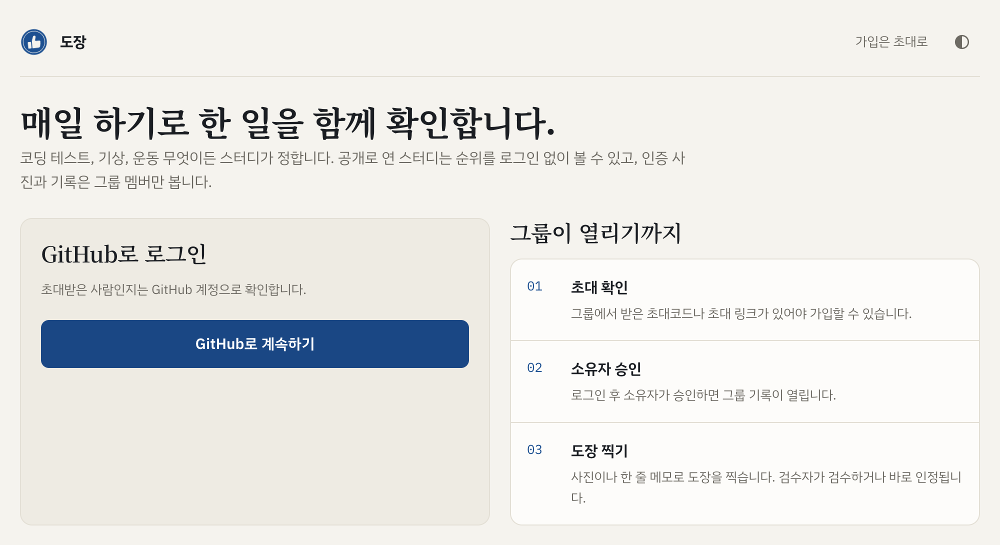

가입은 GitHub 계정으로 합니다. **GitHub로 계속하기**를 누르면 GitHub로 넘어가고, 거기서
허용(Authorize)을 누르면 로그인된 채로 돌아옵니다. 따로 채울 가입 양식은 없습니다. 처음 로그인할
때 계정이 만들어지고, 다음부터는 같은 단추로 로그인합니다. GitHub 계정이 없다면
[GitHub 가입 페이지](https://github.com/signup)에서 먼저 만듭니다.

처음 닉네임은 GitHub 아이디입니다. 로그인한 뒤 오른쪽 위 **프로필**에서 언제든 바꿀 수 있습니다.

첫 화면 아래쪽 **함께하고 있는 스터디**에는 지금 운영 중인 스터디가 나옵니다. 로그인하지 않아도
보이고, 공개로 연 스터디는 누르면 멤버 순위까지 나옵니다.

## 2. 스터디에 들어가기

로그인하면 내 그룹 화면(‘○○님의 그룹’)으로 넘어갑니다. 처음에는 ‘아직 참여 중인 그룹이 없어요’라고
나오고, 그 아래에 **초대코드로 가입**과 **스터디 그룹 만들기** 칸이 있습니다.

첫 화면 오른쪽 위에 ‘가입은 초대로’라고 적혀 있듯, 도장은 초대받은 사람끼리 쓰는 서비스입니다.
초대를 받았으면 가입을 신청하고, 초대가 없으면 스터디를 직접 만들면 됩니다. 스터디 안의 역할은
셋입니다.
스터디를 만든 **소유자**, 소유자가 검수를 맡긴 **검수자**, 그리고 **멤버**입니다.

### 초대를 받았을 때

소유자에게 받은 초대 링크를 열거나, 5자리 초대코드를 **초대코드로 가입** 칸에 넣고 **가입 신청**을
누릅니다. 로그인하기 전에 초대 링크를 열었다면 GitHub로 로그인한 뒤 같은 화면으로 돌아오니, 거기서
**가입 신청**을 누르면 됩니다.

소유자가 **가입 자동 승인**을 켜 둔 스터디라면 신청하는 순간 그룹 화면으로 들어갑니다. 그렇지
않으면 소유자가 승인해야 스터디 기록이 열리고, 그 전까지는 내 그룹 화면 제목 아래에 ‘가입 승인
대기’로만 표시됩니다. 승인되면 목록에 스터디가 나타납니다.

### 스터디를 직접 만들 때

**스터디 그룹 만들기** 칸에 그룹 이름과 그룹 주소를 적고 **그룹 만들기**를 누릅니다. 그룹 주소는
그룹 화면의 주소가 되고, 영문 소문자·숫자·하이픈만 쓸 수 있습니다.

코딩 테스트를 함께 풀 스터디라면 **코딩 테스트 스터디**에도 체크합니다. 그래야 문제 링크를 남기고
‘우리 그룹이 푼 문제’ 목록을 쓸 수 있고, 크롬 확장의 정답 카드도 이렇게 체크한 스터디에만
찍힙니다. 나중에 그룹 설정에서 바꿀 수도 있습니다.

만든 사람은 그 스터디의 소유자가 되어 이런 일을 맡습니다.

- **멤버 초대**: 그룹 화면 오른쪽 위 **멤버 초대**에서 **5자리 초대코드 만들기**를 누르면 초대코드와
  초대 링크가 생깁니다. **링크 복사**로 복사해 스터디 단톡방 같은 곳에 올리면 됩니다. 코드 하나를
  7일 동안 여러 명이 쓸 수 있고, 새로 만들면 이전 코드는 더 쓸 수 없습니다.
- **가입 승인**: 누가 가입을 신청하면 그룹 화면 맨 아래 **멤버 관리**에 이름이 올라옵니다.
  **가입 승인**을 누르면 멤버가 됩니다. 하나씩 승인하기 번거로우면 그룹 설정에서 가입 자동 승인을
  켜 둡니다.
- **검수자 지정**: 같은 **멤버 관리**에서 멤버를 검수자로 바꿀 수 있습니다. 검수를 혼자 다 하기
  벅차면 나눠 맡기면 됩니다.

그룹 이름 옆의 조절기 모양 아이콘을 누르면 그룹 설정이 열립니다. 자주 쓰는 설정은 이렇습니다.

| 설정 | 하는 일 |
|---|---|
| 자동 인정 | 켜면 검수를 기다리지 않고 도장을 찍는 순간 인정됩니다. 소유자와 검수자가 나중에 반려할 수는 있습니다 |
| 사진 필수 | 처음에는 켜져 있습니다. 끄면 사진 없이 한 줄 메모만으로도 도장을 찍을 수 있습니다 |
| 공개 리더보드 | 켜면 로그인하지 않은 사람도 멤버 닉네임과 승인 건수를 볼 수 있습니다. 사진·문제 링크·검수 내용은 공개되지 않습니다 |
| 가입 자동 승인 | 켜면 초대코드로 신청하는 순간 멤버가 됩니다. 코드를 받은 사람은 누구나 바로 들어오니, 체험용처럼 누가 들어와도 괜찮은 스터디에서 켭니다 |
| 디스코드 알림 | 도장·응원·검수가 있을 때마다 스터디가 쓰는 디스코드 채널에 한 줄씩 올라옵니다 |

기상·착석처럼 몇 시에 했는지, 얼마나 했는지를 남기는 스터디라면 **기록 종류**도 여기서 고릅니다.
화면이 어떻게 달라지는지는 [코딩 테스트가 아닌 스터디](#코딩-테스트가-아닌-스터디)에 있습니다.

혼자 먼저 써 보고 싶다면 스터디를 하나 만들면 됩니다. 만든 사람은 바로 멤버라 초대 없이 도장을 찍을
수 있습니다. 다만 자기 도장은 스스로 승인할 수 없으니, 혼자일 때는 **자동 인정**을 켜 두어야 찍는
대로 인정됩니다.

## 3. 그룹 화면 둘러보기

내 그룹 화면에서 스터디 이름을 누르면 그룹 화면이 열립니다. 스터디를 막 만들었다면 바로 이 화면으로
옵니다. 아래는 실제로 운영 중인 코딩 스터디의 그룹 화면이고, 다른 멤버의 이름은 흐리게 가렸습니다.

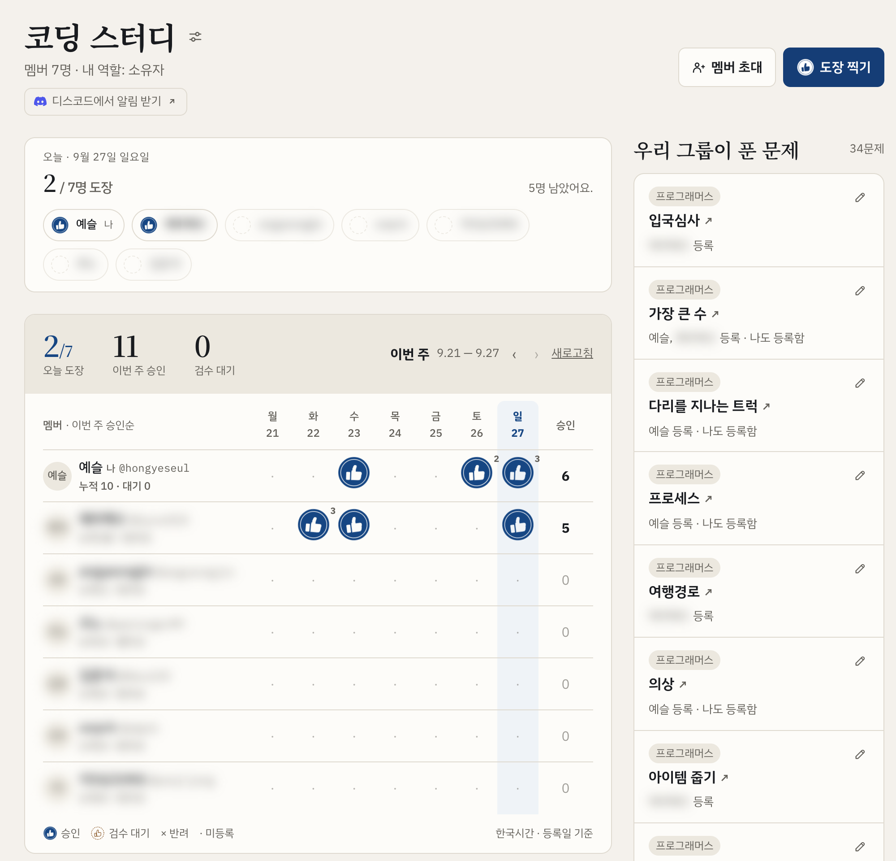

오른쪽 위에 **도장 찍기** 단추가 있고, 소유자에게는 **멤버 초대** 단추도 보입니다. 그 아래에는 세
가지가 놓입니다.

- **오늘 띠**: 오늘 누가 도장을 찍었는지 한눈에 보입니다. 찍은 사람은 이름 앞에 도장이 붙고, 아직
  찍지 않은 사람은 흐리게 남아 있습니다.
- **도장판**: 멤버를 줄로, 요일을 칸으로 놓은 이번 주 현황표입니다. 승인된 날에는 잉크 도장,
  검수를 기다리는 날에는 점선 도장이 찍히고, 하루에 여러 문제를 풀면 개수가 붙습니다. 이번 주에
  승인을 많이 받은 멤버가 위로 올라옵니다.
- **우리 그룹이 푼 문제**: 멤버들이 남긴 문제 링크가 모입니다. 누가 풀었는지도 함께 나와서, 남이 푼
  문제를 바로 따라 풀어 볼 수 있습니다.

## 4. 도장 찍기

문제를 풀었으면 그룹 화면 오른쪽 위 **도장 찍기**를 눌러 아래 창을 엽니다.

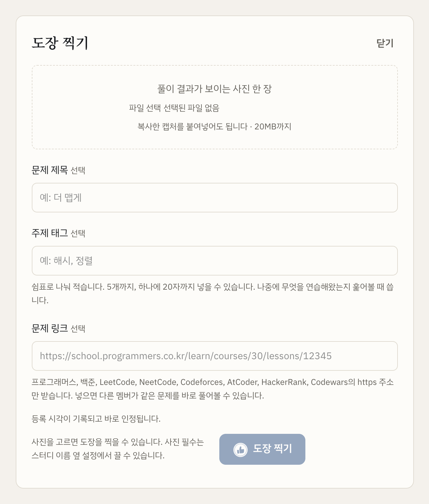

통과 화면을 캡처해 올리고 **도장 찍기**를 누르면 끝입니다. 캡처는 파일로 골라도 되고, 복사해 둔
것을 창에 붙여넣어도 됩니다. 나머지 칸은 비워 둬도 되지만, 적어 두면 쓸모가 있습니다.

- **문제 제목**: 풀이 기록에 이 제목으로 보입니다.
- **주제 태그**: 해시·정렬처럼 무엇을 연습했는지 쉼표로 나눠 5개까지 적습니다. 나중에 스터디가
  무엇을 풀어 왔는지 훑어볼 때 씁니다.
- **문제 링크**: 넣은 링크는 그룹 화면의 ‘우리 그룹이 푼 문제’에 모여, 다른 멤버가 같은 문제를
  바로 풀어 볼 수 있습니다. 프로그래머스·백준·LeetCode 같은 코딩 테스트 사이트 주소만 받습니다.

찍은 도장은 바로 오늘 띠와 도장판에 나타나고, 그룹 화면 아래쪽 **풀이 기록**에도 한 줄 쌓입니다.
이때 상태는 **검수 대기**라 소유자나 검수자의 확인을 기다립니다. 스터디가 **자동 인정**을 켰다면
찍는 순간 인정됩니다. 어느 쪽인지는 창 아래쪽 문구에 나옵니다.

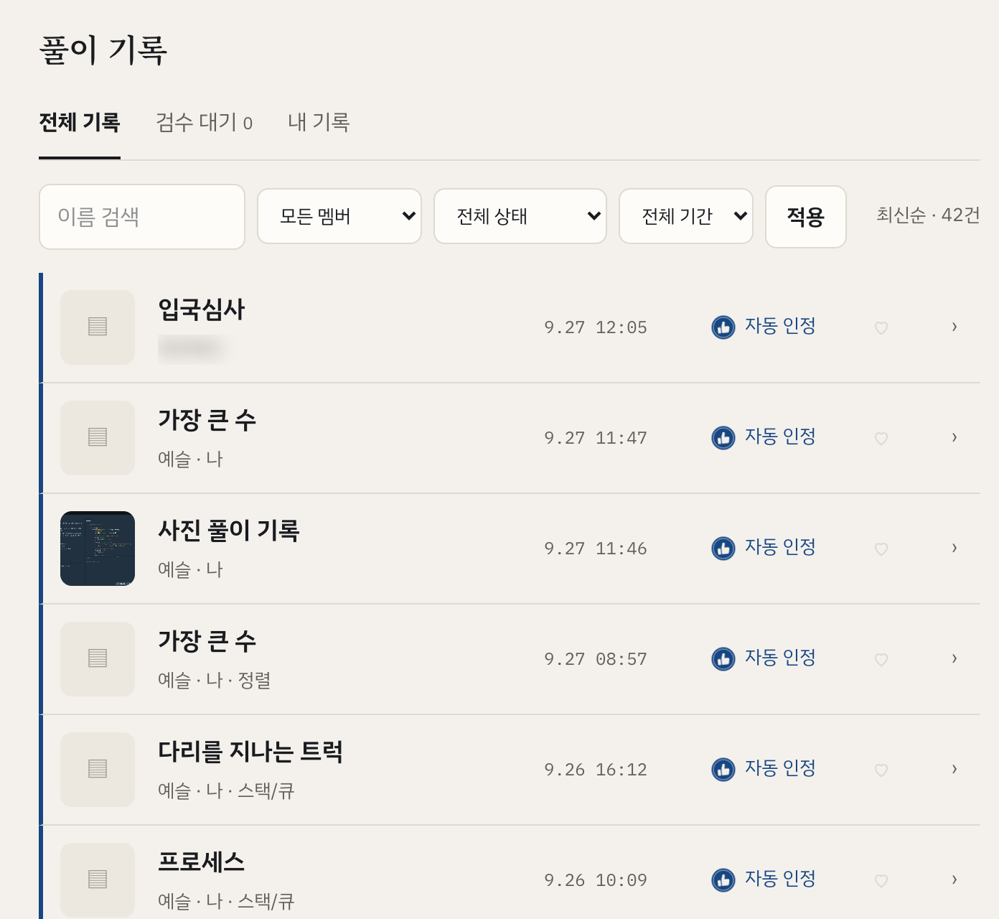

풀이 기록 한 줄에는 문제 제목·멤버·주제 태그·등록 시각·상태가 보이고, **검수 대기**나 **내 기록**
탭으로 좁혀 볼 수 있습니다. 사진으로 남긴 풀이에는 캡처가 작게 붙고, 크롬 확장으로 코드를 남긴
풀이에는 ▤ 표시가 붙습니다.

하루는 자정이 아니라 **새벽 3시**에 바뀝니다. 밤늦게 풀고 새벽 2시에 찍어도 전날 도장으로 셉니다.

캡처하고 옮겨 적는 게 번거롭다면 [크롬 확장](#6-크롬-확장-쓰기)을 쓰면 됩니다. 프로그래머스·
NeetCode·LeetCode에서는 정답이 나온 자리에서 버튼 한 번으로 끝납니다.

## 5. 서로 확인하기

풀이 기록에서 한 줄을 누르면 이 창이 열립니다.

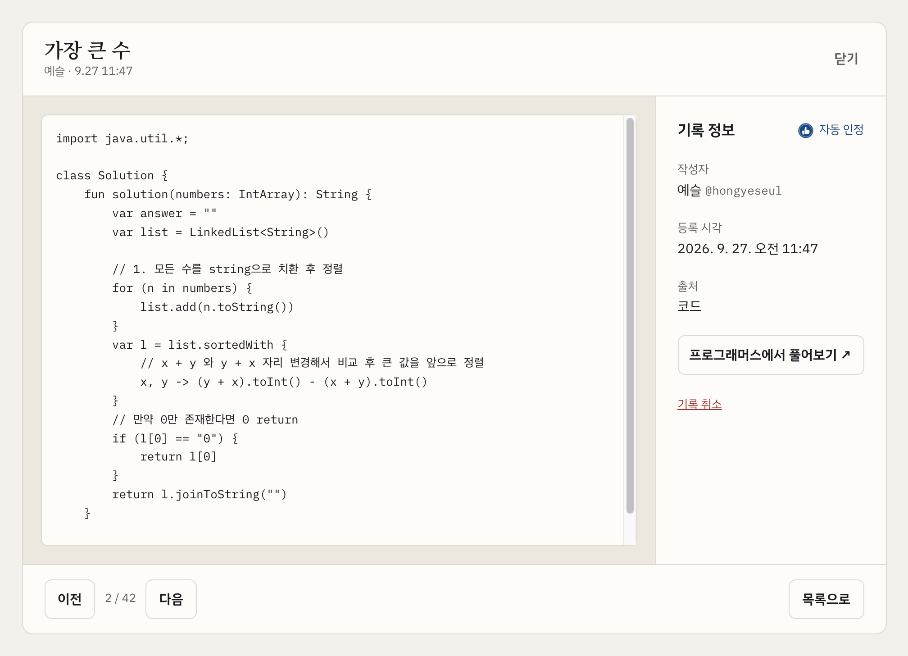

올린 사진이나 코드 전문, 작성자, 등록 시각이 나옵니다. 문제 링크를 남겼다면
**프로그래머스에서 풀어보기**처럼 문제로 바로 가는 단추도 생깁니다.

소유자와 검수자에게는 여기에 **승인**과 **반려** 단추가 함께 보입니다. 승인하면 도장판의 점선
도장에 잉크가 채워집니다. 반려할 때는 이유를 적어야 하고, 그 이유는 멤버 모두가 볼 수 있습니다.

검수 권한이 없는 멤버도 남의 풀이에 **응원**을 남길 수 있습니다. 하트를 한 번 누르는 것이라
검수와는 상관없고, 집계에도 들어가지 않습니다.

잘못 찍은 도장은 검수를 받기 전에 본인이 **기록 취소**로 지울 수 있습니다. 자동 인정으로 들어간
도장도 마찬가지입니다.

## 6. 크롬 확장 쓰기

웹에서 도장을 찍으려면 통과 화면을 캡처하고, 창을 열어 제목과 링크를 옮겨 적어야 합니다. 크롬
확장을 설치하면 이 과정이 버튼 한 번으로 줄어듭니다. 프로그래머스·NeetCode·LeetCode에서 제출한
코드가 정답이면 그 자리에 카드가 뜨고, 문제 제목과 코드는 이미 채워져 있습니다. 사진 대신 코드
전문이 남아서 다른 멤버가 읽고 비교하기도 좋습니다.

### 설치하기

아직 크롬 웹스토어에 올리지 않아서, 파일을 받아 직접 설치합니다.

1. [최신 릴리스](https://github.com/HongYeseul/coding-test-verification/releases/latest)에서
   `dojang-extension-v*.zip`을 받아 압축을 풉니다. 사이트 첫 화면이나 내 그룹 화면의 릴리스
   노트에서 **받으러 가기**를 눌러도 같은 곳으로 갑니다.
2. 크롬 주소창에 `chrome://extensions`를 입력해 엽니다.
3. 오른쪽 위 **개발자 모드**를 켭니다.
4. **압축해제된 확장 프로그램을 로드합니다**를 누르고, 압축을 푼 `dojang-extension` 폴더를
   고릅니다.

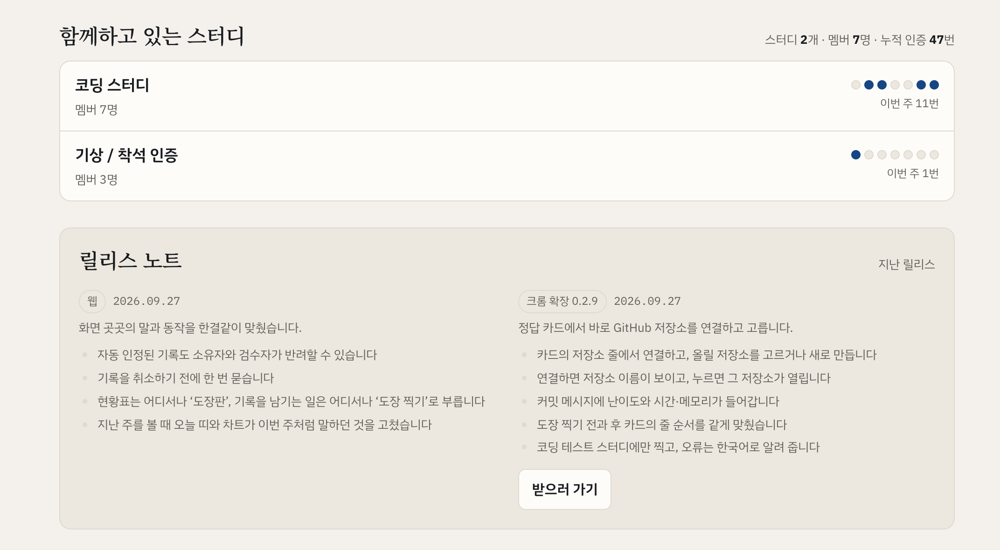

설치한 확장은 주소창 오른쪽의 퍼즐 조각 모양 메뉴 안에 들어가 있습니다. 거기서 도장 확장 옆의
핀을 누르면 툴바에 고정되어 찾기 쉽습니다.

자동 업데이트는 되지 않습니다. 릴리스 노트에서 새 버전 소식을 보면 다시 받아 원래 폴더를 새 것으로
바꾸고, `chrome://extensions`의 도장 항목에서 새로고침 아이콘을 누르면 됩니다.

### 정답 카드로 도장 찍기

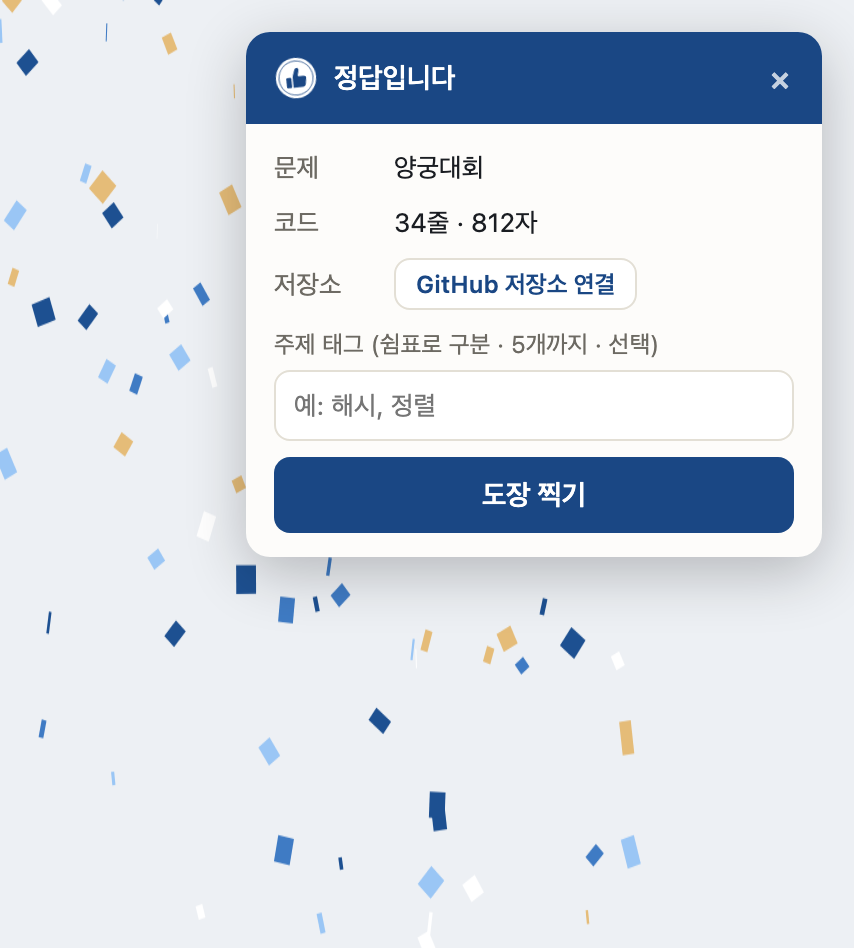

프로그래머스·NeetCode·LeetCode에서 코드를 제출해 정답이 나오면 화면 오른쪽 위에 이 카드가
뜹니다. 문제 제목과 코드 분량은 이미 채워져 있으니, 주제 태그만 필요하면 적고 **도장 찍기**를
누르면 됩니다.

정답을 맞혔다고 저절로 찍히지는 않습니다. 남길지 말지는 직접 정합니다.

로그인하지 않았다면 처음 누를 때 GitHub 로그인 창이 한 번 뜹니다. 웹에서 쓰는 계정으로 로그인하면
됩니다. 코딩 테스트 스터디에 여럿 들어가 있다면 찍을 스터디를 카드에서 한 번 고르고, 그다음부터는
마지막에 고른 스터디로 찍힙니다.

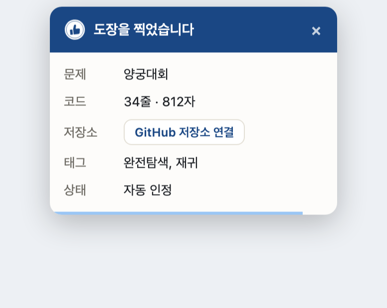

찍고 나면 카드에 무엇이 남았는지 나옵니다. 상태는 스터디 설정에 따라 **검수 대기**나 **자동 인정**으로
표시됩니다. 카드는 5초 뒤 저절로 닫히고, 마우스를 올려 두면 닫히지 않습니다.

웹의 그룹 화면을 열면 방금 찍은 풀이가 오늘 띠와 도장판, 풀이 기록에 들어가 있습니다. 풀이 기록에서
그 줄을 누르면 [기록 상세 창](#5-서로-확인하기)처럼 제출한 코드 전문이 보입니다.

### GitHub 저장소에 올리기

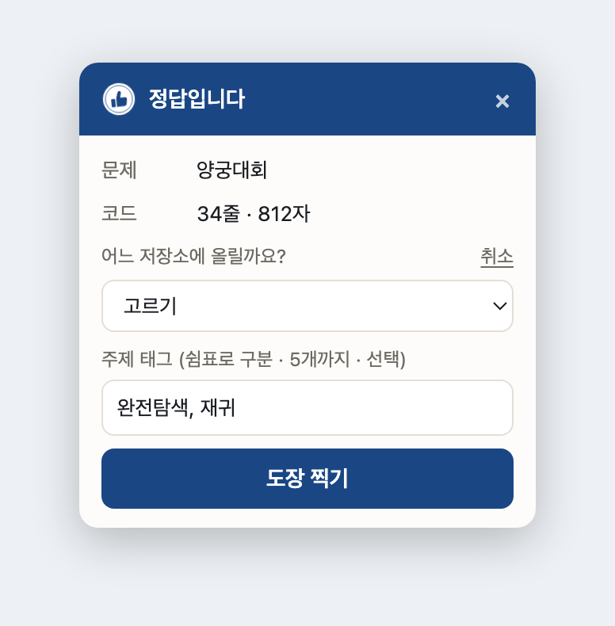

카드의 **저장소** 줄에서 GitHub 저장소를 연결해 두면, 도장을 찍을 때 풀이가 그 저장소에도
올라갑니다. **GitHub 저장소 연결**을 누르면 GitHub 창이 한 번 더 뜨고, 권한을 허용하면 카드에서
올릴 저장소를 고를 수 있습니다. 목록 맨 아래 **새 저장소 만들기…**로 새 공개 저장소를 만들어도
됩니다. 한 번 골라 두면 그다음부터는 도장 찍기 한 번으로 스터디와 저장소 두 곳에 남습니다.
연결하지 않으면 도장만 찍힙니다.

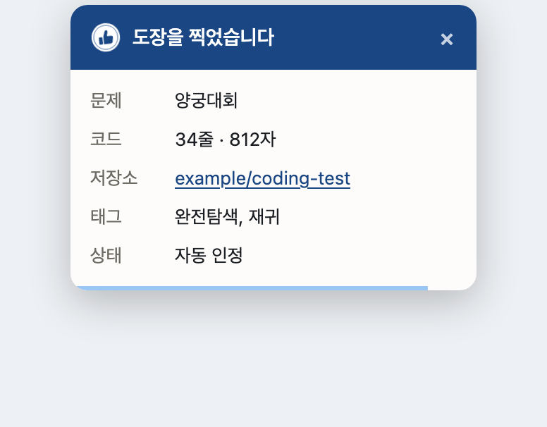

문제 하나가 폴더 하나가 되고, 코드와 README가 커밋 하나로 올라갑니다. 커밋 메시지 첫 줄에는
플랫폼·난이도·제목·채점 결과가 들어가고, 맨 끝에는 도장이 올렸다는 한 줄이 남습니다.

```
프로그래머스/42746. 가장 큰 수/solution.kt
프로그래머스/42746. 가장 큰 수/README.md

[프로그래머스 Lv.2] 가장 큰 수 · 64.31ms · 96.4MB
…
Auto-committed by 도장 (https://coding-test-verification.vercel.app)
```

README에는 제목·플랫폼·난이도·문제 링크·주제 태그만 적고, 문제 설명은 옮기지 않습니다. 문제 설명은
플랫폼의 콘텐츠라 확장이 아예 읽지 않습니다.

[기록 상세 창](#5-서로-확인하기)에서 본 풀이가 실제로 올라간 폴더는
[HongYeseul/studyingAlgorithm](https://github.com/HongYeseul/studyingAlgorithm/tree/master/%ED%94%84%EB%A1%9C%EA%B7%B8%EB%9E%98%EB%A8%B8%EC%8A%A4/42746.%20%EA%B0%80%EC%9E%A5%20%ED%81%B0%20%EC%88%98)에
있습니다. 확장 0.2.8 때 올린 것이라 커밋 메시지가 `[프로그래머스] 가장 큰 수`로 짧습니다.

연결할 때 받는 권한은 공개 저장소에 쓰는 권한이라 비공개 저장소는 고를 수 없습니다. GitHub에서
받은 토큰은 확장 안에만 두고 도장 서버로 보내지 않습니다. 올리다 실패해도 도장은 그대로 남고, 결과
카드에서 다시 올릴 수 있습니다. GitHub 연결이 풀렸으면 대개 저절로 다시 이어지고, 그래도 안 되면
결과 카드에서 바로 다시 연결합니다.

### 카드가 뜨지 않을 때

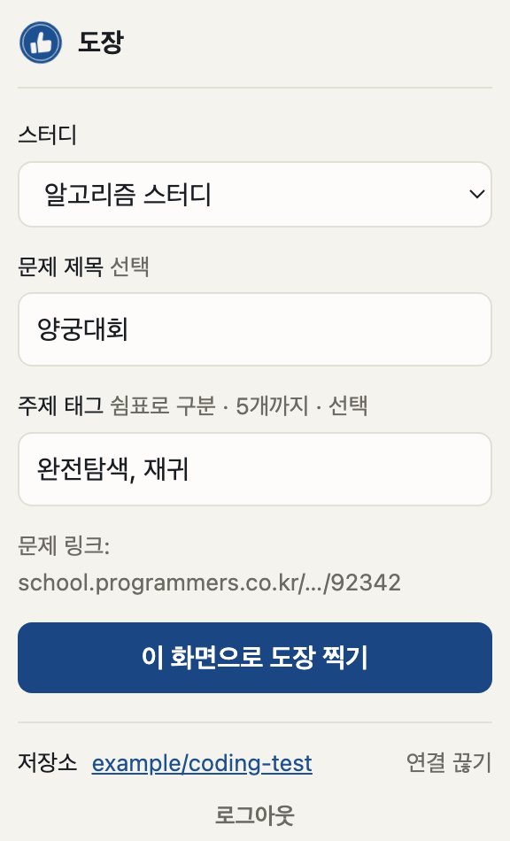

Codeforces·AtCoder처럼 카드가 뜨지 않는 사이트에서는 툴바의 도장 아이콘을 누릅니다. 처음 한 번은
**GitHub로 로그인**을 누르고, 그다음부터는 스터디를 고른 뒤 **이 화면으로 도장 찍기**를 누르면
됩니다. 보고 있는 화면이 캡처되어 올라가고, 지원하는 사이트의 문제 주소라면 문제 링크도 알아서
채워집니다. 웹의 풀이 기록에는 캡처가 붙은 줄로 보입니다. 이렇게 화면으로 찍은 도장은 GitHub
저장소에는 올라가지 않습니다.

LeetCode 대회 문제에서는 카드가 뜨지 않습니다. 대회 중에는 풀이를 공개하면 안 되기 때문입니다.

### 확장이 읽는 것

정답 카드는 본인이 제출한 코드와 채점 결과, 그리고 문제 제목·난이도 같은 식별 정보만 읽습니다.
문제 설명이나 예시, 모범답안은 읽지도 저장하지도 않습니다. 아이콘을 눌러 찍을 때는 그 순간 보이는
화면만 캡처합니다. 권한과 동작은 [extension/README.md](../extension/README.md)에 자세히 적어
두었습니다.

## 코딩 테스트가 아닌 스터디

기상이나 착석처럼 코딩 테스트가 아닌 스터디도 같은 방식으로 씁니다. 그룹 설정의 **기록 종류**에서
**몇 시에 했는지**(기상)나 **얼마나 했는지**(착석)를 고르면 도장과 함께 그 값이 남습니다. 아래는
착석 스터디를 예시 데이터로 그린 화면입니다.

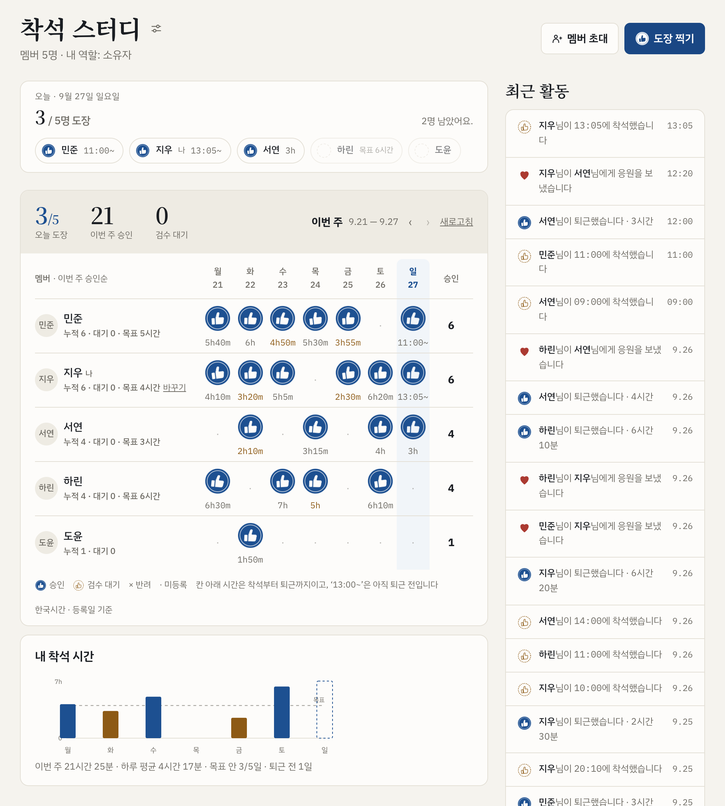

- 착석 스터디는 앉을 때 **착석 도장**, 일어날 때 **퇴근 도장**을 한 번씩 찍습니다. 두 도장 사이가
  그날의 시간이고, 아직 퇴근 전이면 `13:05~`처럼 앉은 시각만 보입니다.
- 목표는 멤버마다 따로 정합니다. 목표에 못 미친 날은 도장판의 시간과 그래프 막대 색이 다릅니다.
- **내 착석 시간** 그래프에서 이번 주에 얼마나 앉아 있었는지 한눈에 봅니다. 기상 스터디는 같은
  자리에 도장을 찍은 시각이 선 그래프로 그려집니다.
- 오른쪽 칸에는 ‘우리 그룹이 푼 문제’ 대신 **최근 활동**이 놓입니다. 누가 언제 착석하고 퇴근했는지,
  누가 응원했는지가 시간순으로 쌓입니다.

## 그 밖에

- **프로필**: 오른쪽 위 **프로필**에서 닉네임과 한 줄 소개를 바꿉니다. 닉네임이 겹쳐도 GitHub
  아이디가 함께 보여 누구인지 헷갈리지 않습니다.
- **디스코드 알림**: 소유자가 디스코드 알림을 켜 두면 도장·응원·검수 소식이 스터디 채널에 한 줄씩
  올라옵니다. 그룹 화면 제목 아래에 **디스코드에서 알림 받기**가 보이면 눌러서 그 채널로 들어갈 수
  있습니다.
- **릴리스 노트**: 첫 화면과 내 그룹 화면에 웹과 확장의 최근 변경이 올라옵니다. 지난 기록은
  [릴리스 노트 페이지](https://coding-test-verification.vercel.app/releases)에서 봅니다.
- **더 자세한 설명**: 서비스를 어떻게 만들었는지는 [README](../README.md)에 있습니다.

## 화면 사진에 대해

웹 화면은 2026년 9월 27일 운영 중인 사이트를 찍었습니다. 공개 저장소라 다른 멤버의 이름·이니셜·GitHub
아이디는 흐리게 가렸습니다. 착석 스터디 화면만은 운영 데이터가 아닙니다. 로컬에 띄운 같은 앱에 예시
멤버와 착석·퇴근 기록을 넣어 찍었습니다. 확장의 카드와 창은 실제 확장의 CSS와 스크립트로 그린 것이고,
안에 든 문제·주제 태그·저장소 이름은 예시입니다.
