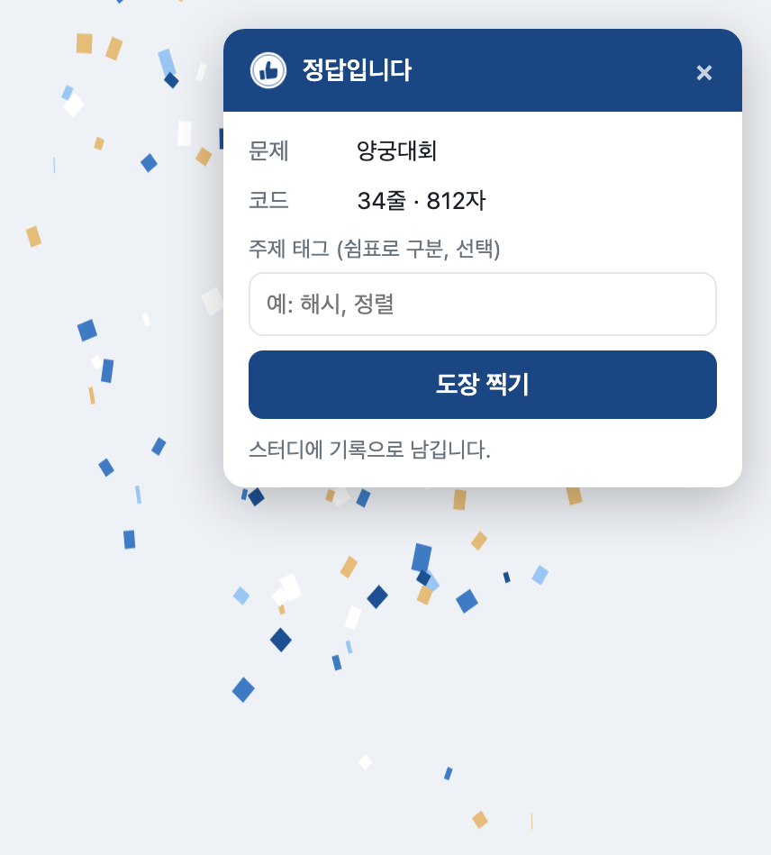
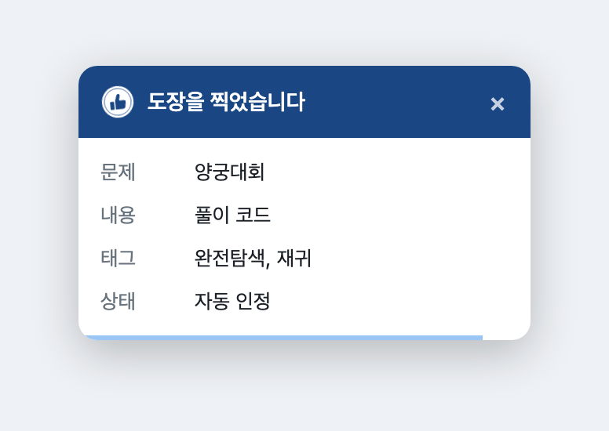
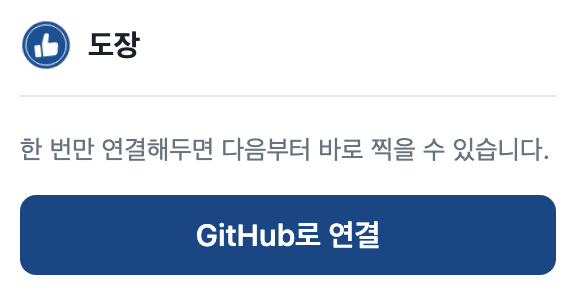
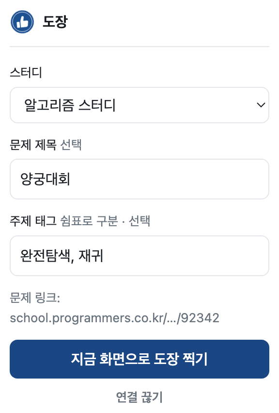

# 도장 확장 프로그램

지금 보고 있는 화면을 한 번에 스터디 인증으로 남깁니다. 앱을 열고 그룹을 찾아 모달을
띄우는 과정을 아이콘 한 번 누르는 것으로 줄이는 게 전부입니다.

## 어떻게 동작하나

### 프로그래머스·NeetCode에서 정답이 나오면

채점 결과가 정답이면 오른쪽 위에 카드가 뜹니다. 무엇이 올라가는지 먼저 보여주고,
**주제 태그를 적어 함께 보낼 수 있습니다.** 두 사이트가 같은 카드를 씁니다
(`content/card.js`). 플랫폼마다 다른 것은 정답을 알아내는 방법뿐입니다.



문제 제목과 코드 분량은 화면에서 읽어 채워 둡니다. 태그만 적고 **도장 찍기** 를 누르면
됩니다.


찍고 나면 무엇이 저장됐는지 보여주고, 아래 막대가 줄어들며 5초 뒤 사라집니다.
읽는 중에 마우스를 올리면 멈춥니다.



이 카드는 사용자가 **도장 찍기를 눌러야** 올라갑니다. 정답을 맞혔다고 저절로 기록되지는
않습니다. 무엇을 남길지는 본인이 정하는 편이 맞다고 봤습니다.

### 아이콘을 눌러 화면으로 남기기

프로그래머스가 아닌 곳이나, 코드 대신 화면을 남기고 싶을 때 씁니다. 처음 한 번은
GitHub로 연결합니다. 웹에서 쓰는 계정과 같습니다.



연결하면 스터디를 고르고 제목과 태그를 적으면 보고 있는 화면을 캡처해 올립니다.
지원하는 플랫폼의 주소면 문제 링크도 자동으로 채워집니다.



## 무엇을 읽나

- 아이콘을 눌렀을 때 **보이는 탭의 화면**과 **탭 주소**
- 프로그래머스에서는 **채점 결과 모달의 제목** (버튼을 띄울지 정하는 데만 쓰고 서버로
  보내지 않습니다)과 **본인이 제출한 코드**
- NeetCode에서는 **제출 요청에 실려 나가는 본인 코드**와 **정답 여부**, 그리고 탭 제목

문제 설명·입출력 예시·힌트·모범답안 같은 플랫폼 콘텐츠는 읽지 않습니다.

화면 캡처는 `activeTab`만 쓰므로 사이트 권한이 필요 없습니다. 정답 감지는 해당 사이트를
봐야 해서 그 사이트 권한이 필요하고, 설치할 때 그 경고가 뜹니다.

### 정답을 알아내는 방법이 왜 사이트마다 다른가

프로그래머스는 결과 모달의 문구를 보고, 코드는 에디터와 동기화된 `textarea#code`에서
읽습니다. CodeMirror는 화면에 보이는 줄만 DOM에 두기 때문에 거기서 긁으면 코드가
잘립니다. **잘린 코드를 올리느니 카드를 안 띄우는 쪽**을 골랐습니다.

NeetCode는 에디터가 Monaco라 같은 이유로 DOM에서 코드를 읽을 수 없습니다. 대신 제출
요청 하나를 봅니다. 제출은 `POST /api/executeCodeFunctionHttp`로 나가고 본문에 코드
전문이 그대로 실려 있어, 잘릴 일이 없습니다. 실행(Run)은 주소가
`runCodeFunctionHttp`로 아예 달라서 정답으로 착각하지 않습니다. 정답 판정은 NeetCode가
쓰는 것과 같은 식(`status.description === "Accepted"`)을 씁니다.

요청을 보려면 페이지와 같은 세계에서 돌아야 해서 `content/neetcode-intercept.js`만
`world: "MAIN"`입니다. 이 파일은 화면을 건드리지 않고, 정답일 때 이벤트 하나만 띄웁니다.
NeetCode는 화면 전환이 페이지 새로고침 없이 일어나므로 `neetcode.io/*` 전체에 붙입니다.
`/problems/*`로 좁히면 목록에서 문제로 들어간 사람에게는 아예 실행되지 않습니다.

### 깨질 수 있는 부분

정답 감지는 사이트가 바뀌면 깨집니다. 깨져도 **카드가 안 뜰 뿐** 다른 건 멀쩡하고,
그때는 아이콘을 눌러 화면 캡처로 도장을 찍으면 됩니다.

NeetCode 쪽 계약은 `tests/neetcode-accepted.test.mjs`가 실제로 주고받은 값으로
검사합니다. 주소나 필드 이름이 바뀌면 사용자가 알기 전에 테스트가 먼저 깨집니다.

LeetCode는 붙이지 않았습니다. 이용약관이 `crawling`·`scraping`을 금지하고 풀이까지
자기 소유라고 적고 있어, 화면 캡처와 수동 검수로 둡니다.

검수 방식은 웹과 같습니다. 기록이 남고 사람이 승인합니다.

## 받는 법

1. [릴리스 페이지](https://github.com/HongYeseul/coding-test-verification/releases/latest)에서 `dojang-extension-v*.zip` 을 받아 압축을 풉니다.
2. 크롬에서 `chrome://extensions` 를 엽니다.
3. 오른쪽 위 **개발자 모드** 를 켭니다.
4. **압축해제된 확장 프로그램을 로드합니다** 로 압축을 푼 `dojang-extension` 폴더를 고릅니다.

주소나 키를 입력할 게 없습니다. `config.js`의 기본값이 운영 환경이고, 거기 들어 있는
publishable key는 배포된 사이트의 자바스크립트에 이미 실려 있는 공개 값입니다. 관리자 키는
들어 있지 않습니다.

크롬 웹스토어 등록 전이라 자동 갱신이 되지 않습니다. 새 버전은 다시 받아 같은 폴더를
교체하고 `chrome://extensions`에서 새로고침을 누르면 됩니다.

저장소를 `git clone` 해서 `extension/` 폴더를 그대로 로드해도 됩니다. 그러면 `git pull`
할 때마다 확장도 함께 갱신됩니다.

### 새 버전 내기

`manifest.json`의 `version`을 올리고 실행합니다. `RELEASE_NOTES.md`가 릴리스 설명이 됩니다.

```bash
bash extension/release.sh            # zip만 만들어 확인
bash extension/release.sh --publish  # 태그와 공개 릴리스까지
```

확장 아이디를 고정하는 `key`가 빠졌거나 설정이 아직 로컬을 가리키면 스크립트가 멈춥니다.

### 확장 아이디가 고정되어 있습니다

`manifest.json`의 `key` 덕분에 누가 설치하든 아이디가 같습니다.

```
pkpabpnpecgcpakaehojnphgeajoieih
```

그래서 GitHub 로그인이 돌아올 주소를 Supabase에 **한 번만** 등록하면 모든 사용자에게
적용됩니다. 이 값이 없으면 사람마다 아이디가 달라 각자 등록해야 했습니다.

```
https://pkpabpnpecgcpakaehojnphgeajoieih.chromiumapp.org/*
```

(Supabase > Authentication > URL Configuration > Redirect URLs)

`key`를 지우거나 바꾸면 아이디가 달라져 로그인이 막힙니다.

## 로컬 개발

로컬 서버와 로컬 Supabase를 가리키게 하려면 사본을 만들어 씁니다. 저장소의
`config.js`를 고치면 작업 트리가 더러워지므로 스크립트가 `~/dojang-extension`에
따로 만들어 줍니다.

```bash
bash extension/install.sh
```

`.env.local`이 있으면 거기서 주소와 키를 읽어 기본값으로 씁니다. 로컬 Supabase는
`supabase/config.toml`에 `https://*.chromiumapp.org/*`가 이미 열려 있습니다.

## 쓰는 법

통과 화면에서 도장 아이콘을 누르고, 스터디를 고른 뒤 **이 화면으로 도장 찍기**를 누릅니다.
처음 한 번만 GitHub로 연결하면 됩니다. 웹앱과 같은 계정이고 같은 권한입니다.

## 구조

| 파일 | 하는 일 |
|---|---|
| `auth.js` | GitHub OAuth(PKCE)와 토큰 갱신. `chrome.identity`를 씁니다 |
| `capture.js` | 탭 화면 캡처와 압축, 탭 주소에서 문제 링크 추출 |
| `popup.js` | 스터디 목록 조회, 업로드, 등록 요청 |
| `background.js` | 콘텐츠 스크립트 대신 서버에 등록 요청 (페이지 오리진에서는 못 보냄) |
| `content/programmers.js` | 채점 결과 감시와 떠 있는 버튼. 선택자가 여기 모여 있습니다 |
| `config.js` | 환경별 주소와 publishable key |
| `seal.js` | 도장 SVG 한 벌. 팝업과 콘텐츠 스크립트가 같이 씁니다 |

의존성과 빌드 단계가 없습니다. 폴더를 그대로 로드하면 동작합니다.

압축 한도(긴 변 1440·1200·1024px, 목표 120KB, 상한 300KB)는 웹앱의
`src/lib/compress-photo.ts`와 같은 값입니다. 한쪽을 바꾸면 다른 쪽도 바꿔야 합니다.

도장도 마찬가지입니다. `seal.js`의 도형 좌표는 웹앱의 `src/components/seal.tsx`와
같습니다. 번들러가 없어 웹앱 컴포넌트를 가져다 쓸 수 없어서 한 벌 더 두었습니다.
색 토큰도 `popup.css`와 `content/overlay.css`에 값을 직접 박아 씁니다 — 페이지의
CSS 변수가 여기까지 닿지 않기 때문입니다. 팔레트를 바꿀 때 세 곳을 같이 봐야 합니다.

## 화면 사진

`screenshots/`의 다섯 장은 실제 `overlay.css`·`popup.css`·`seal.js`로 렌더한 것입니다.
카드는 `programmers.js`가 만드는 DOM과 같은 모양으로 다시 짜서 찍었고, 팝업은
`popup.html`에서 상태만 열어 찍었습니다. 담긴 문제·태그·스터디 이름은 예시입니다 —
공개 저장소라 실제 스터디원의 기록을 넣지 않았습니다.

카드 모양을 바꿨으면 사진도 같이 갱신해야 합니다. 실제로 눌러 찍은 화면이 필요하면
프로그래머스에서 문제를 통과시켜 직접 찍으면 됩니다.

## 아이콘 다시 굽기

`icons/*.png`는 웹앱 파비콘 `src/app/icon.svg`에서 굽습니다. 도장 도형이나 색을
고쳤으면 다시 실행합니다.

```bash
python3 extension/build-icons.py
```

macOS 내장 Quick Look을 쓰므로 macOS에서만 동작하고, 외부 패키지는 필요 없습니다.
Quick Look이 SVG를 흰 배경에 눌러 내놓기 때문에 스크립트가 도장 바깥을 다시
투명하게 만듭니다 — 그대로 쓰면 툴바에 흰 네모가 생깁니다.

관리자 키(`SUPABASE_SECRET_KEY`)는 확장에 넣지 않습니다. publishable key만 씁니다.

## 플랫폼을 늘릴 때

`content/`에 파일을 하나 더 만들고 `manifest.json`의 `content_scripts`와
`host_permissions`에 추가합니다. 감지 방식만 다르고 `background.js`로 보내는 메시지
형식은 같습니다.

백준은 2026년 4월 28일부로 채점 서비스가 멈춰 있어 대상에서 뺐습니다. LeetCode는
Monaco 에디터라 코드를 읽는 방법이 프로그래머스와 다릅니다.
