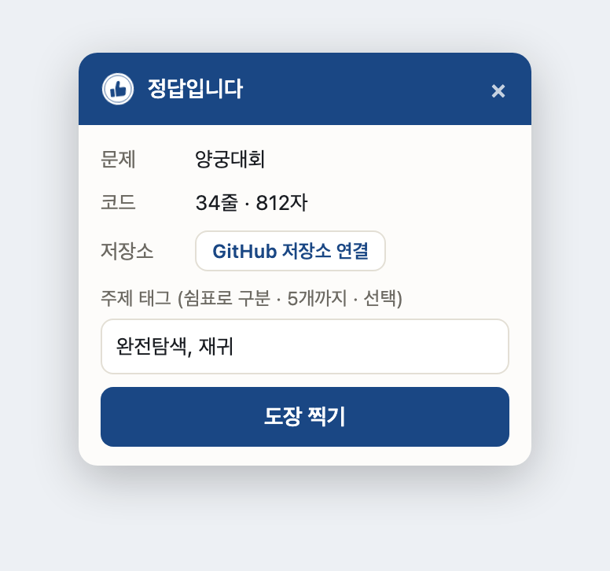
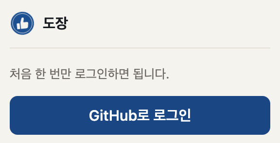

# 도장 확장 프로그램

보고 있는 화면이나 방금 맞힌 풀이로 스터디 도장을 찍습니다. 앱을 열고 그룹을 찾아 모달을
띄우는 과정을 아이콘 한 번 누르는 것으로 줄이는 게 전부입니다.

## 어떻게 동작하나

### 프로그래머스·NeetCode·LeetCode에서 정답이 나오면

채점 결과가 정답이면 오른쪽 위에 카드가 뜹니다. 무엇이 올라가는지 먼저 보여주고,
**주제 태그를 적어 함께 보낼 수 있습니다.** 세 사이트가 같은 카드를 씁니다
(`content/card.js`). 플랫폼마다 다른 것은 정답을 알아내는 방법뿐입니다.


문제 제목과 코드 분량은 화면에서 읽어 채워 둡니다. 태그만 적고 **도장 찍기** 를 누르면
됩니다. 가운데 **저장소** 줄은 GitHub 저장소에 올리는 자리입니다(아래 절).



찍고 나면 무엇이 저장됐는지 보여주고, 아래 막대가 줄어들며 5초 뒤 사라집니다.
읽는 중에 마우스를 올리면 멈춥니다. 줄은 찍기 전과 같은 순서입니다 — 문제, 코드, 저장소,
태그, 그리고 찍은 뒤에만 상태. 같은 자리에 같은 것이 있어야 찍기 전후를 견주지 않고 읽습니다.


이 카드는 사용자가 **도장 찍기를 눌러야** 올라갑니다. 정답을 맞혔다고 저절로 기록되지는
않습니다. 무엇을 남길지는 본인이 정하는 편이 맞다고 봤습니다.

### 아이콘을 눌러 화면으로 남기기

카드가 뜨지 않는 사이트나, 코드 대신 화면을 남기고 싶을 때 씁니다. 처음 한 번은
GitHub로 로그인합니다. 웹에서 쓰는 계정과 같습니다.



로그인하면 스터디를 고르고 제목과 태그를 적으면 보고 있는 화면을 캡처해 올립니다.
지원하는 플랫폼의 주소면 문제 링크도 자동으로 채워집니다.


### GitHub 저장소에 올리기

정답 카드의 **저장소** 줄에서 연결하고 저장소를 고르면, 카드로 도장을 찍을 때 풀이가 그
저장소에도 올라갑니다. 누르는 것은 여전히 도장 찍기 하나이고, 연결하지 않으면 지금과 같습니다.
올라가는 것은 카드로 찍은 풀이뿐입니다. 화면 캡처로 찍은 도장은 올리지 않습니다.

저장소 줄은 늘 보입니다. 팝업을 열어 보지 않은 사람도 정답 순간에 이 기능을 알게 하려는
것입니다. 처음에는 팝업 아래에 접어 두었는데, 그러면 팝업을 한 번이라도 열어 본 사람만
알았습니다.

- **연결 전**: ‘GitHub 저장소 연결’ 단추. 누르면 GitHub 창이 뜨고, 돌아오면 카드 안에서
  저장소를 고릅니다. 고르는 칸 맨 아래 ‘새 저장소 만들기…’로 공개 저장소를 만들 수도 있습니다
- **연결됨**: 저장소 이름과 ‘바꾸기’. 이름을 누르면 그 저장소가 열립니다
- **연결이 풀림**: 고른 저장소 이름과 ‘다시 연결’. 같은 계정이면 저장소를 다시 고르지 않습니다
- **결과 카드**: 올린 문제 폴더로 가는 링크. 찍을 때 연결하지 않았으면 결과 카드에서도 연결할
  수 있고, 저장소를 정하면 방금 찍은 풀이를 올립니다


팝업에는 어느 저장소에 올리고 있는지 한 줄과 ‘연결 끊기’만 둡니다. 연결하고 고르는 일은 카드에서
합니다.

한 문제가 한 폴더이고, 코드와 README가 커밋 하나로 들어갑니다. 원격 브랜치를 바로 옮기므로
push 단계가 따로 없습니다.

```
프로그래머스/42746. 가장 큰 수/solution.py
프로그래머스/42746. 가장 큰 수/README.md
NeetCode/duplicate-integer/solution.py
NeetCode/duplicate-integer/README.md
LeetCode/two-sum/solution.cpp
LeetCode/two-sum/README.md
```

커밋 메시지는 이렇게 남깁니다.

```
[프로그래머스 Lv.2] 가장 큰 수 · 64.31ms · 96.4MB

- 문제: https://school.programmers.co.kr/learn/courses/30/lessons/42746
- 언어: Python3
- 채점: 테스트 11개 통과
- 태그: 정렬

Auto-committed by 도장 (https://coding-test-verification.vercel.app)
```

첫 줄은 GitHub 폴더 목록에도 보여서 플랫폼·난이도·제목·채점 요약을 담습니다. 시간과 메모리는
채점 표의 통과 칸마다 따로 가장 큰 값이고, 프로그래머스가 적은 자릿수를 그대로 씁니다.
NeetCode는 응답에 시간·메모리가 없어 `[NeetCode] Contains Duplicate · 34/34 통과`로 남깁니다.
LeetCode는 채점 응답의 시간·메모리를 붙여 `[LeetCode Easy] 1. Two Sum · 4ms · 14.9MB`로 남깁니다.
LeetCode 폴더는 슬러그(`two-sum`)만 씁니다. 번호는 화면에서 읽는 값이라 못 읽을 때가 있고, 그러면
같은 문제가 두 폴더로 갈라집니다. 번호는 제목에 붙어 README와 커밋에 남습니다.
SQL처럼 채점 표가 없는 문제는 수치를 빼고 적습니다 — 0을 적으면 실제로 잰 값처럼 보입니다.
백준허브(`[level 2] Title: …, Time: …, Memory: … -BaekjoonHub`)와 달리 플랫폼을 적어 여러
플랫폼이 한 저장소에 섞여도 갈립니다. 어느 서비스가 올렸는지는 본문 맨 끝 한 줄
(`Auto-committed by 도장 (…)`)로 남깁니다. 저장소를 보는 사람도 알 수 있어야 해서입니다.
첫 줄에는 넣지 않습니다 — 폴더 목록에서 문제 이름보다 서비스 이름이 먼저 읽히면 남의 커밋
이력이 광고처럼 보입니다. 주소는 `config.js`를 따라가 로컬에서 올리면 로컬 주소가 남습니다.

README에는 제목·플랫폼·난이도·문제 링크·태그만 적습니다. **문제 설명은 옮기지 않습니다.**
플랫폼 콘텐츠라 읽지도 않고, 저장소가 공개라 더 그렇습니다. 백준허브와 가장 다른 점이
이것입니다. 같은 문제를 다시 풀면 같은 파일을 덮어써 이력으로 남고, 내용이 같으면 커밋하지
않습니다. 파일 확장자는 제출한 언어로 정하고, 모르는 언어는 코드를 잃지 않도록 `solution.txt`로
둡니다. 폴더 경로에는 난이도를 넣지 않았습니다 — 먼저 올린 문제가 두 곳으로 갈라집니다.

도장과 올리기는 따로 갑니다. 올리다 실패해도 도장은 남고, 결과 카드에서 다시 올릴 수
있습니다. 올리는 동안과 실패했을 때, 결과 카드에서 연결하거나 고르는 동안에는 카드가 사라지지
않습니다. 올라갔는지 보기 전에 닫히면 확인할 길이 없기 때문입니다.

브랜치 끝은 올릴 때마다 GitHub에 새로 묻습니다(`fetch`의 `cache: "no-cache"`). GitHub는 읽기
응답에 `Cache-Control: private, max-age=60`을 붙여, 그대로 두면 브라우저가 1분 동안 GitHub에 묻지
않고 옛 응답을 돌려줍니다. 0.2.12까지는 한 문제를 올리고 1분 안에 다음 문제를 올리면 방금 옮긴
끝 대신 그 전 끝 위에 커밋을 지어 브랜치를 옮기지 못했고(422), 다시 읽어도 같은 옛 값이라 ‘그
사이 저장소가 바뀌어 올리지 못했습니다’로 끝났습니다. 그 사이 다른 커밋이 끼어들면 한 번 다시
하는 로직도 같은 까닭으로 실제로는 듣지 않았습니다. 테스트의 가짜 GitHub는 이 캐시를 흉내 냅니다.

**권한.** 연결하면 같은 GitHub 로그인을 `public_repo` 권한을 더해 한 번 더 거칩니다. 웹 로그인은
그대로입니다. OAuth 앱 권한은 저장소 하나로 좁힐 수 없어 **공개 저장소 전체에 쓰는 권한**이고,
그래서 비공개 저장소는 고를 수 없습니다. 비공개까지 쓰려면 모든 비공개 저장소를 여는 `repo`를
받아야 합니다. 저장소 하나로 좁히는 길은 GitHub App을 따로 등록하는 것인데, 코드를 토큰으로
바꾸는 데 client secret이 필요해 서버가 끼어야 합니다. 지금은 확장만 고치는 쪽을 골랐습니다.

**토큰.** Supabase는 GitHub 토큰을 로그인 응답에 한 번 실어 줄 뿐 보관하지 않으므로 확장이
`chrome.storage.local`에 둡니다. 서버로는 보내지 않고 `api.github.com`만 부릅니다. 이 주소는
어느 오리진에나 CORS를 열어 두어 사이트 권한을 새로 받지 않습니다. 카드는 남의 페이지에
붙어 있으니 토큰을 받지 않고, 연결·목록·고르기·만들기를 모두 background에 부탁합니다. 카드가
보내는 저장소 이름도 background가 모양을 다시 봅니다. GitHub가 토큰을 거절하면 토큰만 버리고
고른 저장소는 남겨, 같은 계정으로 다시 연결하면 그대로 이어 씁니다. 팝업의 ‘연결 끊기’와
‘로그아웃’은 확장이 가진 토큰을 버리는 데까지입니다. GitHub에서 권한까지 거두려면
[Authorized OAuth Apps](https://github.com/settings/applications)에서 지웁니다. 토큰을 폐기하는
API는 client secret이 있어야 해서 확장이 부를 수 없습니다.

**로그인 창은 background가 띄웁니다.** 팝업의 ‘GitHub로 로그인’도, 카드의 저장소 연결도
그렇습니다. 팝업에서 띄우면 로그인을 마친 창이 닫히며 포커스가 브라우저 창으로 돌아오는 순간
팝업도 닫혀, 받은 코드를 토큰으로 바꿀 곳이 사라집니다. 0.2.9까지는 팝업이 직접 띄워서 로그인
창을 거치면 로그인이 남지 않았습니다(크롬 153에서 재현). GitHub에 이미 로그인하고 앱을 승인해
둬서 창이 뜨지 않을 때만 팝업에서도 끝났습니다. 지금은 팝업이 닫혀도 로그인이 끝나고, 다시 열면
폼이 보입니다. 카드에서 연결하는 동안에는 도장 찍기를 잠급니다 — 로그인하지 않은 채 누르면
도장 찍기도 GitHub 창을 열어, 창이 둘 뜹니다.

## 무엇을 읽나

- 아이콘을 눌렀을 때 **보이는 탭의 화면**과 **탭 주소**
- 프로그래머스에서는 **채점 결과 모달의 제목** (버튼을 띄울지 정하는 데만 쓰고 서버로
  보내지 않습니다), **본인이 제출한 코드**, 그 코드의 **언어 값**(에디터에 붙은
  `data-language`. 저장소에 올릴 파일 확장자만 정합니다), **채점 결과 표의 통과 칸**
  (`td.result.passed`), 문제의 **식별 정보** — 제목과 난이도(`.lesson-content`의
  `data-challenge-level`). 채점 결과와 난이도는 커밋 메시지와 README에만 씁니다
- NeetCode에서는 **제출 요청에 실려 나가는 본인 코드와 언어**, **정답 여부와 통과한 테스트
  수**, 그리고 탭 제목
- LeetCode에서는 **제출 요청에 실려 나가는 본인 코드와 언어**, 채점 응답의 **정답 여부·통과한
  테스트 수·시간·메모리**, 그리고 문제 영역 머리의 **번호·제목·난이도**(`1. Two Sum`, `Easy`).
  오답이면 같은 응답에 틀린 테스트의 입력과 기대 출력이 실리는데, 플랫폼 데이터라 꺼내지 않습니다

문제 설명·입출력 예시·힌트·모범답안 같은 플랫폼 콘텐츠는 읽지 않습니다. GitHub 저장소에도
올리지 않습니다.

화면 캡처는 `activeTab`만 쓰므로 사이트 권한이 필요 없습니다. 정답 감지는 해당 사이트를
봐야 해서 그 사이트 권한이 필요하고, 설치할 때 그 경고가 뜹니다. `scripting`은 설치하거나
새 버전으로 바꾸는 순간 이미 열려 있던 문제 탭에 감지 스크립트를 넣는 데만 씁니다.

### 정답을 알아내는 방법이 왜 사이트마다 다른가

프로그래머스는 결과 모달의 문구를 보고, 코드는 에디터와 동기화된 `textarea#code`에서
읽습니다. CodeMirror는 화면에 보이는 줄만 DOM에 두기 때문에 거기서 긁으면 코드가
잘립니다. **잘린 코드를 올리느니 카드를 안 띄우는 쪽**을 골랐습니다.

NeetCode는 에디터가 Monaco라 같은 이유로 DOM에서 코드를 읽을 수 없습니다. 대신 제출
요청 하나를 봅니다. 제출은 `POST /api/executeCodeFunctionHttp`로 나가고 본문에 코드
전문이 그대로 실려 있어, 잘릴 일이 없습니다. 실행(Run)은 주소가
`runCodeFunctionHttp`로 아예 달라서 정답으로 착각하지 않습니다. 정답 판정은 NeetCode가
쓰는 것과 같은 식(`status.description === "Accepted"`)을 씁니다.

요청은 **`XMLHttpRequest`로** 나갑니다. NeetCode는 Angular HttpClient를 쓰고 그 기본값이
XHR입니다. 처음에 `fetch`만 가로챘다가 카드가 아예 뜨지 않았습니다. `fetch` 쪽도 함께
보지만 그건 HttpClient가 `withFetch()`로 바뀔 때의 대비고, 지금 실제로 쓰이는 길은 XHR입니다.
응답은 `responseType`에 따라 읽는 법이 달라, `json`으로 받을 때 `responseText`를 건드리면
예외가 납니다. 둘 다 처리합니다.

요청을 보려면 페이지와 같은 세계에서 돌아야 해서 `content/neetcode-intercept.js`는
`world: "MAIN"`입니다. 이 파일은 화면을 건드리지 않고, 정답일 때 이벤트 하나만 띄웁니다.
NeetCode는 화면 전환이 페이지 새로고침 없이 일어나므로 `neetcode.io/*` 전체에 붙입니다.
`/problems/*`로 좁히면 목록에서 문제로 들어간 사람에게는 아예 실행되지 않습니다.

LeetCode도 NeetCode처럼 제출 요청을 봅니다. 에디터가 Monaco라 이유도 같습니다. 2026-09-29에
Two Sum을 실제로 제출해 본 흐름은 이렇습니다. 셋 다 `fetch`로 나갑니다.

```
제출  POST /problems/two-sum/submit/          {"lang","question_id","typed_code"}
      ← {"submission_id": 2156492751}
채점  GET  /submissions/detail/2156492751/v2/check/   PENDING → STARTED → SUCCESS
      ← {"state":"SUCCESS","status_msg":"Accepted","total_correct":65, "status_runtime":"4 ms", ...}
실행  POST /problems/two-sum/interpret_solution/  ← {"interpret_id":"runcode_…"}
      GET  /submissions/detail/runcode_…/check/  ← 역시 SUCCESS·Accepted
```

**실행(Run) 결과도 `Accepted`로 옵니다.** 채점 응답만 보면 실행을 정답으로 착각하므로, 제출
응답이 돌려준 번호의 채점만 봅니다. 처음에는 채점 주소를 `/check/`로 짐작했는데 실제 제출은
`/v2/check/`로 결과를 받아 카드가 뜨지 않았습니다. 직접 제출해 보고서야 알았습니다. 지금은
둘 다 받습니다. 대회 문제는 `/contest/` 아래에서 제출되어 걸리지 않습니다 — 대회 중에는 풀이를
공개하면 안 되니 일부러 넓히지 않았습니다.

번호·제목·난이도는 설명 탭 머리에서 읽습니다. 제출하면 결과 탭으로 넘어가 설명 탭이 숨지만
DOM에는 남아 있습니다. 제출한 문제의 슬러그로 제목 링크를 찾고 그 탭 안에서만 난이도를 봐서,
화면 전환 뒤 다른 문제의 제목을 읽지 않습니다. 설명 탭이 없으면 탭 제목에서 제목만 가져옵니다.
LeetCode도 화면 전환이 새로고침 없이 일어나므로 `leetcode.com/*` 전체에 붙입니다.

### LeetCode 약관을 어떻게 읽었나

처음에는 LeetCode를 붙이지 않았습니다. 약관이 `crawling`·`scraping`·`spidering`을 금지하고,
콘텐츠 조항에 풀이(solutions)까지 자기 소유라고 적혀 있어서였습니다. 2026-09-29에 다시 읽고
붙였습니다.

- 같은 금지 조항이 프로그래머스 이용약관에도 있습니다. 금지 행위와 푸터에 "무단 복제, 전송,
  배포, 크롤링, 스크래핑"이 적혀 있고, 확장은 처음부터 프로그래머스에 붙어 있었습니다. 조항이
  있다는 것만으로는 LeetCode만 뺄 이유가 되지 않습니다
- 크롤링은 프로그램이 스스로 페이지를 돌아다니는 일이고, 스크래핑은 사이트의 콘텐츠를 뽑아
  모으는 일입니다. 이 확장은 LeetCode에 요청을 하나도 더 보내지 않습니다. 사용자가 연 페이지에서
  사용자가 누른 제출 한 건이 오가는 것을 볼 뿐이고, 가져오는 것은 본인이 쓴 코드와 본인의 채점
  결과, 문제를 가리키는 번호·제목·난이도입니다. 약관이 따로 막는 '로그인하지 않은 동안 도는
  프로세스'나 '서비스에 부하를 주는 일'에도 해당하지 않습니다
- 소유 조항의 풀이는 LeetCode가 쓴 풀이로 읽힙니다. 바로 다음 문단이 사용자가 올린 것에 대해서는
  비독점(non-exclusive) 이용 허락만 받는다고 적고 있어, 본인 코드를 본인 저장소에 두는 것과
  부딪치지 않습니다. 에디토리얼·문제 설명·다른 사람의 풀이는 읽지 않습니다
- LeetHub 계열 확장(크롬 웹스토어의 LeetHub v2만 6만 명, 2026-09)은 제출이 끝나면 GraphQL을
  더 불러 문제 설명까지 README에 옮깁니다. 여기서는 둘 다 하지 않습니다

그래도 약관을 해석하는 쪽은 LeetCode라 위험이 없지는 않습니다. LeetCode가 멈춰 달라고 하면
`content/leetcode*.js` 두 파일과 manifest 항목을 빼면 되고, 아이콘을 눌러 화면으로 남기는 길은
그대로 남습니다.

### 문제를 열어 둔 채 설치하거나 바꿀 때

크롬은 manifest의 `content_scripts`를 설치한 **뒤에** 불러온 페이지에만 넣습니다. 문제를
열어 둔 채 확장을 설치하면 그 탭에서는 정답을 맞혀도 카드가 뜨지 않았고, 새로고침해야
붙었습니다. 그래서 설치하거나 새 버전으로 바꾸는 순간(`runtime.onInstalled`) `inject.js`가
열려 있는 문제 탭을 찾아 manifest에 적힌 스크립트를 그대로 넣습니다. 크롬 자체가
업데이트될 때는 탭이 새로 열리며 크롬이 넣으므로 건너뜁니다.

새 버전으로 바꿀 때는 옛 스크립트가 탭에 남습니다. 확장과 끊겨 `chrome.runtime`을
잃었을 뿐 타이머와 이벤트는 그대로 돌아 카드도 띄웁니다. 그 카드는 눌러도 보낼 곳이 없어
버튼이 ‘연결하고 남기는 중…’에 멈췄습니다. 새로 넣은 스크립트는 옛 것과 **다른 격리
세계**에서 돌아 서로의 전역을 볼 수 없고, 페이지 DOM만 같이 씁니다. 그래서 이렇게 나눕니다.

- 감지 스크립트는 `chrome.runtime`이 사라진 것을 보면 스스로 멈추고 자기가 띄운 카드를 치웁니다
- 카드에는 어느 세계가 띄웠는지 `data-dojang`으로 적고, 저마다 자기 카드만 다룹니다
- 0.2.6까지의 카드에는 이 표시가 없어 `overlay.css`가 가립니다. 그 스크립트는 멈출 줄
  모르기 때문입니다
- 설치하는 순간 막 열리던 탭에는 같은 세계에 두 번 들어갑니다. 늦게 온 쪽만 남습니다
- 페이지 쪽 세계는 하나뿐이라 `neetcode-intercept.js`·`leetcode-intercept.js`는 이미
  감쌌으면 다시 감싸지 않습니다. 그래서 이 둘을 고치면 새로고침한 탭부터 적용됩니다

### 깨질 수 있는 부분

정답 감지는 사이트가 바뀌면 깨집니다. 깨져도 **카드가 안 뜰 뿐** 다른 건 멀쩡하고,
그때는 아이콘을 눌러 화면 캡처로 도장을 찍으면 됩니다.

NeetCode·LeetCode 쪽 계약은 `tests/neetcode-accepted.test.mjs`·`tests/leetcode-accepted.test.mjs`가
실제로 주고받은 값으로 검사합니다. 주소나 필드 이름이 바뀌면 사용자가 알기 전에 테스트가 먼저
깨집니다. 다만 테스트는 저장해 둔 값을 보므로, 사이트가 바뀐 것은 실제로 제출해 봐야 압니다.

카드 모양은 남의 페이지 CSS에 밀릴 수 있습니다. 크롬은 확장이 넣은 CSS를 페이지 스타일보다
**앞에** 두어, 특이도가 같으면 페이지가 이깁니다. 0.2.11에서 LeetCode의
`[type="button"], button { background-color: initial }`이 도장 찍기의 파란 바탕을 지워 흰
글자만 남았고, 단추가 사라진 것처럼 보였습니다. 그래서 카드 규칙은 `.dojang-card`를 앞에
붙여 한 단계 높이고, 단추 규칙은 `tests/extension-card-css.test.mjs`가 지킵니다. 페이지에
카드를 흉내 내 띄워 볼 때도 `<style>`을 `<head>` 맨 앞에 넣어야 실제와 같습니다 — 뒤에 넣으면
우리 규칙이 이겨 이 문제가 가려집니다.

검수 방식은 웹과 같습니다. 기록이 남고, 자동 인정을 켠 그룹이 아니면 소유자·검수자가 승인합니다.

## 받는 법

1. [릴리스 페이지](https://github.com/HongYeseul/coding-test-verification/releases/latest)에서 `dojang-extension-v*.zip` 을 받아 압축을 풉니다.
2. 크롬에서 `chrome://extensions` 를 엽니다.
3. 오른쪽 위 **개발자 모드** 를 켭니다.
4. **압축해제된 확장 프로그램을 로드합니다** 로 압축을 푼 `dojang-extension` 폴더를 고릅니다.

주소나 키를 입력할 게 없습니다. `config.js`의 기본값이 운영 환경이고, 거기 들어 있는
publishable key는 배포된 사이트의 자바스크립트에 이미 실려 있는 공개 값입니다. 관리자 키는
들어 있지 않습니다.

크롬 웹스토어 등록 전이라 자동 갱신이 되지 않습니다. 새 버전은 다시 받아 같은 폴더를
교체하고 `chrome://extensions`에서 새로고침을 누르면 됩니다. 열어 둔 문제 탭은
새로고침하지 않아도 됩니다.

저장소를 `git clone` 해서 `extension/` 폴더를 그대로 로드해도 됩니다. 그러면 `git pull`
할 때마다 확장도 함께 갱신됩니다.

### 새 버전 내기

`manifest.json`의 `version`을 올리고 실행합니다. `RELEASE_NOTES.md`가 릴리스 설명이 됩니다.

`RELEASE_NOTES.md`에는 **이번 버전 것만** 둡니다. 지난 버전을 위에 쌓으면 새 릴리스
설명에 옛 내용이 통째로 다시 실려 읽을 것이 계속 늘어납니다. 지난 버전은 각자
자기 릴리스 페이지에 이미 남아 있습니다. 대시보드 카드에 나가는 문구는
`src/lib/release-notes.ts`에 있으니 함께 고칩니다.

내기 전에 고친 것은 `RELEASE_NOTES.md`의 다음 버전 절에만 쌓아 둡니다. `manifest.json`의
`version`과 `release-notes.ts`는 낼 때 바꿉니다. 웹은 `main`에 올라가는 대로 배포되고 가장 최근
확장 항목의 번호를 manifest에서 읽어서, 먼저 바꾸면 아직 없는 버전을 알리게 됩니다.

```bash
bash extension/release.sh            # zip만 만들어 확인
bash extension/release.sh --publish  # 태그와 공개 릴리스까지
```

확장 아이디를 고정하는 `key`가 빠졌거나 설정이 아직 로컬을 가리키면 스크립트가 멈춥니다.

### 확장 아이디가 고정되어 있습니다

`manifest.json`의 `key` 덕분에 누가 설치하든 아이디가 같습니다.

```
pkpabpnpecgcpakaehojnphgeajoieih
```

그래서 GitHub 로그인이 돌아올 주소를 Supabase에 **한 번만** 등록하면 모든 사용자에게
적용됩니다. 이 값이 없으면 사람마다 아이디가 달라 각자 등록해야 했습니다.

```
https://pkpabpnpecgcpakaehojnphgeajoieih.chromiumapp.org/*
```

(Supabase > Authentication > URL Configuration > Redirect URLs)

`key`를 지우거나 바꾸면 아이디가 달라져 로그인이 막힙니다.

## 로컬 개발

로컬 서버와 로컬 Supabase를 가리키게 하려면 사본을 만들어 씁니다. 저장소의
`config.js`를 고치면 작업 트리가 더러워지므로 스크립트가 `~/dojang-extension`에
따로 만들어 줍니다.

```bash
bash extension/install.sh
```

`.env.local`이 있으면 거기서 주소와 키를 읽어 기본값으로 씁니다. 로컬 Supabase는
`supabase/config.toml`에 `https://*.chromiumapp.org/*`가 이미 열려 있습니다.

## 쓰는 법

통과 화면에서 도장 아이콘을 누르고, 스터디를 고른 뒤 **이 화면으로 도장 찍기**를 누릅니다.
처음 한 번만 GitHub로 로그인하면 됩니다. 웹앱과 같은 계정이고 같은 권한입니다.

## 구조

| 파일 | 하는 일 |
|---|---|
| `auth.js` | GitHub OAuth(PKCE)와 토큰 갱신. `chrome.identity`를 씁니다 |
| `capture.js` | 탭 화면 캡처와 압축, 탭 주소에서 문제 링크 추출 |
| `popup.js` | 스터디 목록 조회, 업로드, 등록 요청, 저장소 한 줄과 끊기 |
| `background.js` | 콘텐츠 스크립트 대신 서버에 등록 요청 (페이지 오리진에서는 못 보냄), 로그인 창 띄우기, 저장소 연결과 올리기 |
| `github.js` | 저장소 연결·목록·만들기와 커밋. `api.github.com`만 부릅니다 |
| `solution-files.js` | 저장소에 올릴 경로와 README를 짓습니다. 크롬 API가 없어 node 테스트가 그대로 부릅니다 |
| `inject.js` | 설치·교체 때 이미 열려 있던 문제 탭에 콘텐츠 스크립트를 넣음 |
| `content/programmers.js` | 프로그래머스 채점 결과 감시. 선택자가 여기 모여 있습니다 |
| `content/neetcode.js`, `content/neetcode-intercept.js` | NeetCode 제출 요청을 엿봐 정답을 알아냄 |
| `content/leetcode.js`, `content/leetcode-intercept.js` | LeetCode 제출 요청과 채점 응답을 엿봐 정답을 알아냄 |
| `errors.js` | 크롬·Supabase·GitHub가 준 영어 오류를 우리 문장으로 바꿈 |
| `content/card.js` | 정답 카드와 결과 카드. 저장소 줄(연결·고르기·만들기)도 여기 있습니다 |
| `config.js` | 환경별 주소와 publishable key |
| `seal.js` | 도장 SVG 한 벌. 팝업과 콘텐츠 스크립트가 같이 씁니다 |

의존성과 빌드 단계가 없습니다. 폴더를 그대로 로드하면 동작합니다.

압축 한도(긴 변 1440·1200·1024px, 목표 120KB, 상한 300KB)는 웹앱의
`src/lib/compress-photo.ts`와 같은 값입니다. 한쪽을 바꾸면 다른 쪽도 바꿔야 합니다.

도장도 마찬가지입니다. `seal.js`의 도형 좌표는 웹앱의 `src/components/seal.tsx`와
같습니다. 번들러가 없어 웹앱 컴포넌트를 가져다 쓸 수 없어서 한 벌 더 두었습니다.
색 토큰도 `popup.css`와 `content/overlay.css`에 값을 직접 박아 씁니다 — 페이지의
CSS 변수가 여기까지 닿지 않기 때문입니다. 팔레트를 바꿀 때 세 곳을 같이 봐야 합니다.

## 화면 사진

`screenshots/`의 일곱 장은 실제 `overlay.css`·`popup.css`·`seal.js`로 렌더한 것입니다.
카드는 `programmers.js`가 만드는 DOM과 같은 모양으로 다시 짜서 찍었고, 팝업은
`popup.html`에서 상태만 열어 찍었습니다. 담긴 문제·태그·스터디·저장소 이름은 예시입니다 —
공개 저장소라 실제 스터디원의 기록을 넣지 않았습니다. 일곱 장 모두 2026-09-27에
`card.js`로 그린 카드와 크롬 API를 흉내 낸 `popup.html`을 헤드리스 크롬으로 2배 찍었습니다.
꽃가루는 몇 프레임만 그리고 멈춰 찍었습니다.

카드 모양을 바꿨으면 사진도 같이 갱신해야 합니다. 실제로 눌러 찍은 화면이 필요하면
프로그래머스에서 문제를 통과시켜 직접 찍으면 됩니다.

## 아이콘 다시 굽기

`icons/*.png`는 웹앱 파비콘 `src/app/icon.svg`에서 굽습니다. 도장 도형이나 색을
고쳤으면 다시 실행합니다.

```bash
python3 extension/build-icons.py
```

macOS 내장 Quick Look을 쓰므로 macOS에서만 동작하고, 외부 패키지는 필요 없습니다.
Quick Look이 SVG를 흰 배경에 눌러 내놓기 때문에 스크립트가 도장 바깥을 다시
투명하게 만듭니다 — 그대로 쓰면 툴바에 흰 네모가 생깁니다.

관리자 키(`SUPABASE_SECRET_KEY`)는 확장에 넣지 않습니다. publishable key만 씁니다.

## 플랫폼을 늘릴 때

`content/`에 파일을 하나 더 만들고 `manifest.json`의 `content_scripts`와
`host_permissions`에 추가합니다. 감지 방식만 다르고 `background.js`로 보내는 메시지
형식은 같습니다. GitHub 저장소에도 올리려면 `solution-files.js`의 `PLATFORMS`에 문제
주소를 폴더로 바꾸는 규칙을 더합니다. 없으면 도장은 찍히고 올리기만 실패합니다.

백준은 2026년 4월 28일부로 채점 서비스가 멈춰 있어 대상에서 뺐습니다.

붙이기 전에 약관을 봅니다. `크롤링`·`스크래핑` 금지 조항만으로는 빼지 않습니다 — 위의
‘LeetCode 약관을 어떻게 읽었나’처럼, 사용자가 누른 제출이 오가는 것만 보고 플랫폼에 따로
요청을 보내지 않는 한 그 조항이 겨누는 일이 아니라고 봤습니다. 브라우저 확장이나 외부 도구
자체를 금지하는 플랫폼, 운영자가 멈춰 달라고 한 플랫폼에는 붙이지 않습니다.
